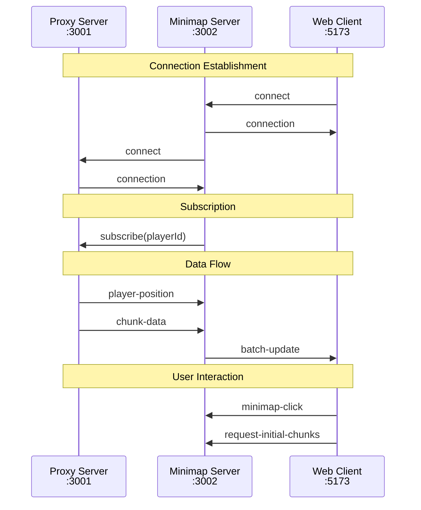

# Socket.io Events API Reference

This document provides a comprehensive reference for all Socket.io events used in the Minecraft Bedrock Minimap system.

## Event Flow Overview



## Type Definitions

All events use TypeScript interfaces from the shared package:

```typescript
import type {
  PlayerPosition,
  ChunkData,
  BatchUpdateData,
  ChunkResponse,
  ConnectionStatus,
  OreLocation
} from '@minecraft-bedrock-minimap/shared';
```

## Proxy Server Events (Port 3001)

### Outgoing Events (Server → Client)

#### `connection-status`

Initial connection information and status updates.

**Payload:**
```typescript
interface ConnectionStatus {
  connected: boolean;
  playerId?: string;
  timestamp: number;
  message?: string;
}
```

**Example:**
```typescript
socket.emit('connection-status', {
  connected: true,
  playerId: 'steve123',
  timestamp: 1641234567890
});
```

**When emitted:**
- On initial client connection
- When Minecraft connection state changes
- On proxy server startup/shutdown

#### `player-position`

Player location and rotation updates from Minecraft.

**Payload:**
```typescript
interface PlayerPosition {
  x: number;      // Block X coordinate
  y: number;      // Block Y coordinate
  z: number;      // Block Z coordinate
  pitch: number;  // Vertical rotation (-90 to 90)
  yaw: number;    // Horizontal rotation (0 to 360)
}
```

**Example:**
```typescript
socket.emit('player-position', {
  x: 128.5,
  y: 64.0,
  z: -256.3,
  pitch: -12.5,
  yaw: 180.0
});
```

**When emitted:**
- On player movement (throttled to 20 Hz)
- On player teleportation
- On dimension changes

#### `chunk-data`

Processed chunk information ready for minimap display.

**Payload:**
```typescript
interface ChunkResponse {
  type: 'chunk';
  x: number;              // Chunk X coordinate
  z: number;              // Chunk Z coordinate
  dimension: number;      // 0=Overworld, 1=Nether, 2=End
  timestamp: number;      // Processing timestamp
  chunks: Array<{
    position: { x: number; y: number; z: number };
    chunk: any;           // Serialized chunk data
  }>;
}
```

**Example:**
```typescript
socket.emit('chunk-data', {
  type: 'chunk',
  x: 0,
  z: 0,
  dimension: 0,
  timestamp: 1641234567890,
  chunks: [{
    position: { x: 0, y: 0, z: 0 },
    chunk: { /* prismarine chunk data */ }
  }]
});
```

**When emitted:**
- When new chunks are loaded from Minecraft
- On chunk updates (block changes)
- On chunk invalidation

#### `world-reset`

Signals that the world has changed or been reset.

**Payload:** None

**Example:**
```typescript
socket.emit('world-reset');
```

**When emitted:**
- On server restart
- When connecting to different world
- On dimension changes

### Incoming Events (Client → Server)

#### `subscribe`

Subscribe to updates for a specific player.

**Payload:**
```typescript
string // Player ID
```

**Example:**
```typescript
socket.emit('subscribe', 'steve123');
```

**Response:** Server starts sending player updates

#### `unsubscribe`

Unsubscribe from player updates.

**Payload:**
```typescript
string // Player ID
```

**Example:**
```typescript
socket.emit('unsubscribe', 'steve123');
```

**Response:** Server stops sending player updates

## Minimap Server Events (Port 3002)

### Outgoing Events (Server → Client)

#### `batch-update`

Efficient batched chunk updates with optional player position.

**Payload:**
```typescript
interface BatchUpdateData {
  chunks: ChunkData[];          // Array of processed chunks
  playerPosition?: PlayerPosition; // Optional position update
  timestamp: number;            // Batch timestamp
  batchId: string;             // Unique batch identifier
}

interface ChunkData {
  x: number;                   // Chunk X coordinate
  z: number;                   // Chunk Z coordinate
  colors: string[][];          // 16x16 array of hex colors
  heights?: number[][];        // 16x16 array of Y coordinates
  dimension?: number;          // Dimension ID
  ores?: OreLocation[];        // Optional ore data
}
```

**Example:**
```typescript
socket.emit('batch-update', {
  chunks: [
    {
      x: 0,
      z: 0,
      colors: [
        ['#7F7F7F', '#7F7F7F', ...], // 16 colors
        // ... 15 more rows
      ],
      heights: [
        [64, 65, ...], // 16 heights
        // ... 15 more rows
      ],
      ores: [
        { x: 5, y: 12, z: 8, oreType: 'diamond', blockName: 'minecraft:diamond_ore' }
      ]
    }
  ],
  playerPosition: { x: 8, y: 64, z: 8, pitch: 0, yaw: 90 },
  timestamp: 1641234567890,
  batchId: 'batch-abc123'
});
```

**When emitted:**
- Every 100ms when chunks are pending
- On player position changes
- When cache invalidation occurs

#### `player-move`

Simplified player position for UI updates.

**Payload:**
```typescript
interface PlayerMove {
  x: number;        // Block X coordinate
  z: number;        // Block Z coordinate
  dimension: number; // Current dimension
}
```

**Example:**
```typescript
socket.emit('player-move', {
  x: 128,
  z: -256,
  dimension: 0
});
```

**When emitted:**
- On significant player movement
- When viewport needs updating
- On dimension changes

#### `connection-status`

Forwarded connection status from proxy server.

**Payload:** Same as proxy server `connection-status`

#### `performance-metrics`

Server performance and statistics.

**Payload:**
```typescript
interface PerformanceMetrics {
  networkReduction: number;     // Percentage saved through batching
  cacheHitRate: number;         // Cache efficiency percentage
  activeClients: number;        // Connected web clients
  cachedChunks: number;         // Chunks in cache
  avgBatchSize: number;         // Average chunks per batch
  memoryUsageMB: number;        // Memory consumption
}
```

**Example:**
```typescript
socket.emit('performance-metrics', {
  networkReduction: 82.5,
  cacheHitRate: 94.2,
  activeClients: 3,
  cachedChunks: 15420,
  avgBatchSize: 47.3,
  memoryUsageMB: 156.8
});
```

**When emitted:**
- Every 30 seconds in development mode
- On request via admin interface

### Incoming Events (Client → Server)

#### `request-initial-chunks`

Request cached chunks when client connects.

**Payload:**
```typescript
interface InitialChunksRequest {
  viewport?: {
    centerX: number;
    centerZ: number;
    width: number;
    height: number;
  };
  dimension?: number;
}
```

**Example:**
```typescript
socket.emit('request-initial-chunks', {
  viewport: {
    centerX: 0,
    centerZ: 0,
    width: 512,
    height: 512
  },
  dimension: 0
});
```

**Response:** `batch-update` with cached chunks

#### `minimap-click`

Handle click events on the minimap.

**Payload:**
```typescript
interface MinimapClick {
  x: number;          // World X coordinate
  z: number;          // World Z coordinate
  dimension: number;  // Current dimension
  ctrlKey?: boolean;  // Modifier key state
  shiftKey?: boolean;
  button?: number;    // Mouse button (0=left, 1=middle, 2=right)
}
```

**Example:**
```typescript
socket.emit('minimap-click', {
  x: 128,
  z: -256,
  dimension: 0,
  ctrlKey: false,
  shiftKey: true,
  button: 0
});
```

**Response:** Depends on implementation (teleportation, waypoints, etc.)

#### `update-settings`

Update minimap rendering settings.

**Payload:**
```typescript
interface SettingsUpdate {
  renderDistance?: number;
  blockSize?: number;
  showGrid?: boolean;
  oreDetection?: {
    enabled: boolean;
    scanYOffset: number;
    oreTypes: Record<string, { enabled: boolean; color: string }>;
  };
}
```

**Example:**
```typescript
socket.emit('update-settings', {
  renderDistance: 8,
  oreDetection: {
    enabled: true,
    scanYOffset: 30,
    oreTypes: {
      diamond: { enabled: true, color: '#00FFFF' }
    }
  }
});
```

#### `request-chunks`

Explicitly request specific chunks.

**Payload:**
```typescript
interface ChunkRequest {
  chunks: Array<{
    x: number;
    z: number;
    dimension: number;
  }>;
  priority?: 'high' | 'normal' | 'low';
}
```

**Example:**
```typescript
socket.emit('request-chunks', {
  chunks: [
    { x: 0, z: 0, dimension: 0 },
    { x: 1, z: 0, dimension: 0 }
  ],
  priority: 'high'
});
```

## Error Handling

### Error Events

All services emit error events for handling connection and processing issues:

#### `error`

General error information.

**Payload:**
```typescript
interface ErrorData {
  code: string;
  message: string;
  details?: any;
  timestamp: number;
}
```

**Example:**
```typescript
socket.emit('error', {
  code: 'CHUNK_PROCESSING_FAILED',
  message: 'Failed to process chunk at 0,0',
  details: { chunkX: 0, chunkZ: 0, error: 'Invalid data format' },
  timestamp: 1641234567890
});
```

#### `connect_error`

Connection establishment errors.

**Payload:**
```typescript
Error // Standard JavaScript Error object
```

### Error Codes

| Code | Description | Resolution |
|------|-------------|------------|
| `CONNECTION_FAILED` | Socket.io connection failed | Check server status and network |
| `INVALID_CHUNK_DATA` | Malformed chunk data received | Check proxy server logs |
| `RATE_LIMIT_EXCEEDED` | Too many requests | Reduce request frequency |
| `UNAUTHORIZED` | Authentication failed | Check credentials |
| `SERVER_OVERLOAD` | Server cannot handle load | Reduce concurrent connections |

## Usage Examples

### Client Connection (Web)

```typescript
import { io, Socket } from 'socket.io-client';
import type { 
  MinimapToWebEvents, 
  WebToMinimapEvents 
} from '@minecraft-bedrock-minimap/shared';

const socket: Socket<MinimapToWebEvents, WebToMinimapEvents> = io('http://localhost:3002', {
  transports: ['websocket'],
  reconnection: true,
  reconnectionAttempts: 5,
  reconnectionDelay: 1000
});

// Connection handling
socket.on('connect', () => {
  console.log('Connected to minimap server');
  socket.emit('request-initial-chunks');
});

socket.on('connect_error', (error) => {
  console.error('Connection failed:', error);
});

// Data handling
socket.on('batch-update', (batch) => {
  console.log(`Received ${batch.chunks.length} chunks`);
  batch.chunks.forEach(chunk => {
    renderChunk(chunk);
  });
  
  if (batch.playerPosition) {
    updatePlayerMarker(batch.playerPosition);
  }
});

socket.on('player-move', (position) => {
  smoothUpdatePlayerPosition(position);
});

// User interaction
function handleMinimapClick(x: number, z: number) {
  socket.emit('minimap-click', {
    x, z,
    dimension: currentDimension,
    ctrlKey: false,
    shiftKey: false,
    button: 0
  });
}
```

### Server Implementation (Minimap Server)

```typescript
import { Server, Socket } from 'socket.io';
import type { 
  MinimapToWebEvents, 
  WebToMinimapEvents 
} from '@minecraft-bedrock-minimap/shared';

const io = new Server<WebToMinimapEvents, MinimapToWebEvents>(3002, {
  cors: {
    origin: "http://localhost:5173",
    methods: ["GET", "POST"]
  }
});

io.on('connection', (socket) => {
  console.log('Client connected:', socket.id);
  
  // Handle initial chunk request
  socket.on('request-initial-chunks', (request) => {
    const cachedChunks = chunkCache.getVisibleChunks(request.viewport);
    
    socket.emit('batch-update', {
      chunks: cachedChunks,
      timestamp: Date.now(),
      batchId: generateBatchId()
    });
  });
  
  // Handle settings updates
  socket.on('update-settings', (settings) => {
    clientSettings.set(socket.id, settings);
    console.log('Updated settings for client:', socket.id);
  });
  
  // Handle clicks
  socket.on('minimap-click', (clickData) => {
    console.log('Minimap clicked at:', clickData.x, clickData.z);
    // Implement teleportation or waypoint logic
  });
  
  // Cleanup on disconnect
  socket.on('disconnect', () => {
    console.log('Client disconnected:', socket.id);
    clientSettings.delete(socket.id);
  });
});

// Broadcast updates to all clients
function broadcastChunkUpdate(chunk: ChunkData) {
  io.emit('batch-update', {
    chunks: [chunk],
    timestamp: Date.now(),
    batchId: generateBatchId()
  });
}
```

## Performance Considerations

### Batching Strategy

- **Batch Window**: 100ms default
- **Max Batch Size**: 50 chunks default
- **Deduplication**: Automatic for same chunks
- **Priority**: High priority chunks sent first

### Rate Limiting

- **Chunk Requests**: 50 per second per client
- **Settings Updates**: 10 per minute per client
- **Click Events**: 20 per second per client

### Compression

Socket.io compression is enabled by default for payloads > 1KB:

```typescript
const io = new Server(port, {
  compression: true,
  perMessageDeflate: {
    threshold: 1024,
    concurrencyLimit: 10
  }
});
```

This API reference provides the complete Socket.io event specification for the Minecraft Bedrock Minimap system, enabling type-safe development and proper integration between all components.