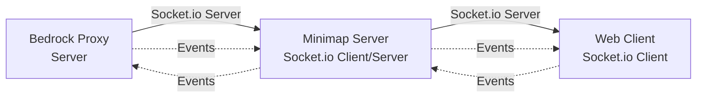
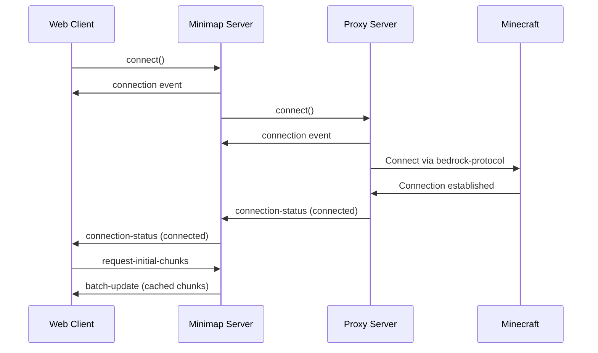
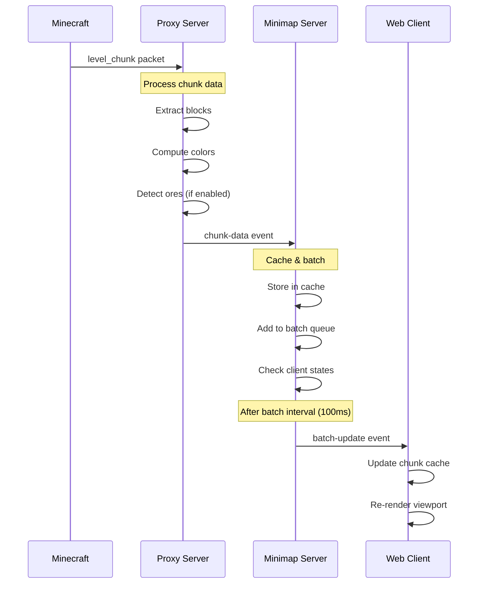
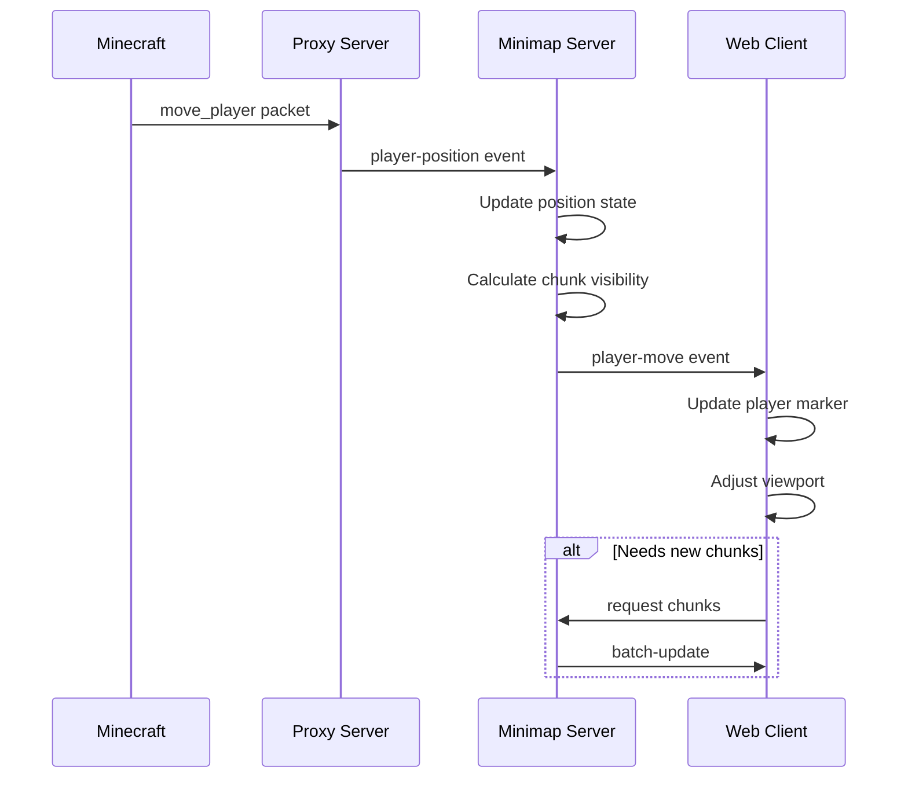
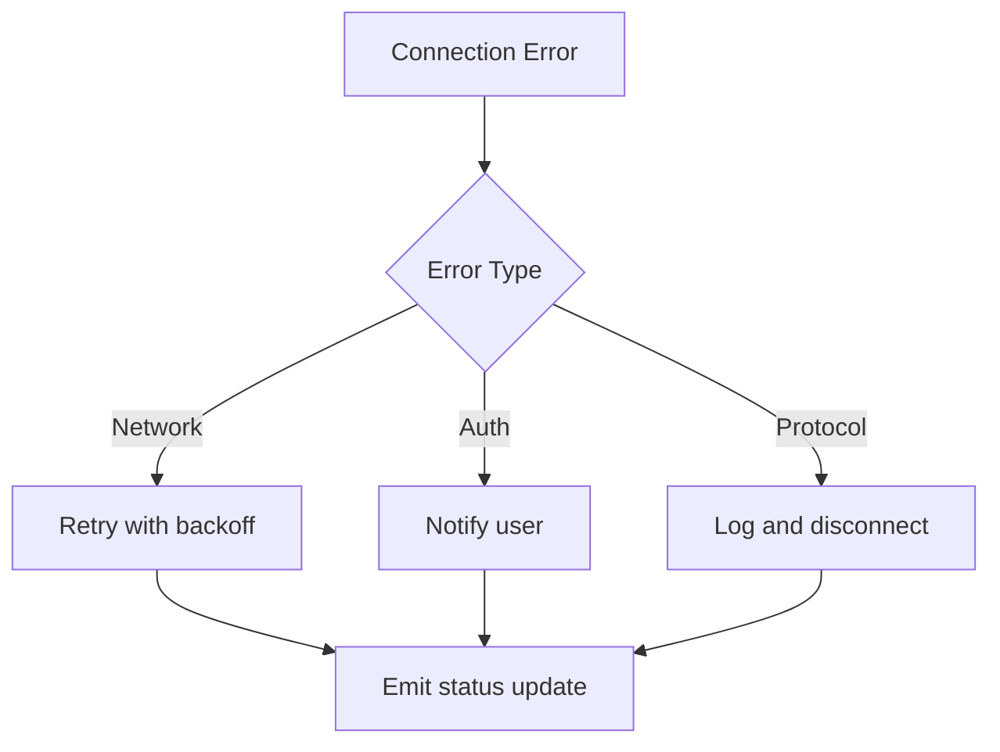

# Communication Flow

This document details the Socket.io event-based communication between components in the Minecraft Bedrock Minimap system.

## Communication Architecture



## Socket.io Namespaces

### Default Namespace (`/`)
All communication uses the default namespace with typed events for type safety.

```typescript
// Server-to-Client Events
interface ServerToClientEvents {
  'connection-status': (data: ConnectionStatusData) => void;
  'chunk-data': (data: ChunkData) => void;
  'batch-update': (data: BatchUpdateData) => void;
  'player-move': (data: PlayerPosition) => void;
  // ... more events
}

// Client-to-Server Events
interface ClientToServerEvents {
  'request-initial-chunks': (data: InitialChunksRequest) => void;
  'minimap-click': (data: MinimapClickData) => void;
  'subscribe': (playerId: string) => void;
  // ... more events
}
```

## Event Flow Patterns

### 1. Initial Connection Flow



### 2. Chunk Update Flow



### 3. Player Movement Flow



## Event Reference

### Proxy Server → Minimap Server Events

#### `chunk-data`
Sends processed chunk data to the minimap server.

```typescript
interface ChunkData {
  x: number;              // Chunk X coordinate
  z: number;              // Chunk Z coordinate
  dimension: number;      // 0=Overworld, 1=Nether, 2=End
  colors: Uint8Array;     // Pre-computed colors (16x16x3 RGB)
  heights: Uint8Array;    // Height map (16x16)
  timestamp: number;      // Processing timestamp
  ores?: OreLocation[];   // Optional ore locations
}
```

#### `player-position`
Updates player position and rotation.

```typescript
interface PlayerPosition {
  x: number;    // Block X coordinate
  y: number;    // Block Y coordinate
  z: number;    // Block Z coordinate
  yaw: number;  // Horizontal rotation
  pitch: number; // Vertical rotation
}
```

#### `connection-status`
Indicates Minecraft connection state changes.

```typescript
interface ConnectionStatusData {
  status: 'connected' | 'disconnected' | 'error';
  message?: string;
  timestamp: number;
}
```

#### `world-reset`
Signals that the world has changed or reset.

```typescript
// No payload - signals to clear all cached data
```

### Minimap Server → Proxy Server Events

#### `subscribe`
Subscribes to updates for a specific player.

```typescript
// Payload: playerId (string)
```

#### `unsubscribe`
Unsubscribes from player updates.

```typescript
// Payload: playerId (string)
```

### Minimap Server → Web Client Events

#### `batch-update`
Sends multiple chunk updates in a single event.

```typescript
interface BatchUpdateData {
  chunks: ChunkData[];      // Array of chunk updates
  playerPosition?: PlayerPosition;  // Optional position update
  timestamp: number;        // Batch timestamp
  batchId: string;         // Unique batch identifier
}
```

#### `player-move`
Simplified player position for UI updates.

```typescript
interface PlayerMoveData {
  x: number;
  z: number;
  dimension: number;
}
```

#### `connection-status`
Forwarded connection status from proxy.

```typescript
// Same as proxy ConnectionStatusData
```

#### `initial-data`
Sends initial state when client connects.

```typescript
interface InitialData {
  chunks: ChunkData[];
  playerPosition?: PlayerPosition;
  settings: MinimapSettings;
}
```

### Web Client → Minimap Server Events

#### `request-initial-chunks`
Requests cached chunks on connection.

```typescript
interface InitialChunksRequest {
  viewport: {
    centerX: number;
    centerZ: number;
    width: number;
    height: number;
  };
  dimension: number;
}
```

#### `minimap-click`
Handles click events on the minimap.

```typescript
interface MinimapClickData {
  x: number;          // World X coordinate
  z: number;          // World Z coordinate
  dimension: number;  // Current dimension
  ctrlKey: boolean;   // Modifier keys
  shiftKey: boolean;
}
```

#### `update-settings`
Updates minimap rendering settings.

```typescript
interface SettingsUpdate {
  renderDistance?: number;
  showGrid?: boolean;
  oreDetection?: OreDetectionConfig;
  // ... other settings
}
```

## Batching Strategy

### Server-Side Batching

The minimap server implements intelligent batching to reduce network traffic:

```typescript
class BatchProcessor {
  private pendingUpdates = new Map<clientId, Set<chunkKey>>();
  private batchInterval = 100; // milliseconds
  
  // Collect updates
  queueUpdate(clientId: string, chunkKey: string) {
    if (!this.pendingUpdates.has(clientId)) {
      this.pendingUpdates.set(clientId, new Set());
    }
    this.pendingUpdates.get(clientId).add(chunkKey);
  }
  
  // Process batches periodically
  processBatches() {
    for (const [clientId, chunkKeys] of this.pendingUpdates) {
      const chunks = Array.from(chunkKeys)
        .map(key => this.chunkCache.get(key))
        .filter(Boolean);
      
      if (chunks.length > 0) {
        this.emit('batch-update', { chunks, timestamp: Date.now() });
      }
    }
    this.pendingUpdates.clear();
  }
}
```

### Benefits
- **80% reduction** in network messages
- **Deduplication** of chunk updates
- **Prioritization** of chunks near player
- **Configurable** batch size and interval

## Error Handling

### Connection Errors



### Event Error Handling

```typescript
// Wrap event handlers with error boundaries
socket.on('chunk-data', (data) => {
  try {
    validateChunkData(data);
    processChunk(data);
  } catch (error) {
    console.error('Invalid chunk data:', error);
    // Don't propagate - handle gracefully
  }
});
```

## Performance Considerations

### Event Throttling
- Player position updates throttled to 20Hz
- Chunk requests limited to 50 per second
- Batch updates sent at most every 100ms

### Payload Optimization
- Use typed arrays for binary data
- Compress large payloads with Socket.io compression
- Send deltas instead of full updates when possible

### Connection Management
- Automatic reconnection with exponential backoff
- Connection state recovery
- Clean disconnection handling

## Security Considerations

### Authentication
```typescript
// Minimap server authentication middleware
io.use((socket, next) => {
  const token = socket.handshake.auth.token;
  if (isValidToken(token)) {
    next();
  } else {
    next(new Error('Authentication failed'));
  }
});
```

### Rate Limiting
```typescript
const rateLimiter = new Map<string, number>();

socket.on('request-chunks', (data) => {
  const requests = rateLimiter.get(socket.id) || 0;
  if (requests > MAX_REQUESTS_PER_SECOND) {
    return; // Silently drop
  }
  rateLimiter.set(socket.id, requests + 1);
  // Process request
});
```

### Input Validation
- All events validated with Zod schemas
- Bounds checking on coordinates
- Sanitization of user inputs

## Debugging Socket.io Communication

### Enable Debug Logging
```bash
# Client-side
localStorage.debug = 'socket.io-client:*'

# Server-side
DEBUG=socket.io:* npm run dev
```

### Socket.io Admin UI
```typescript
// Enable admin UI in development
import { instrument } from '@socket.io/admin-ui';

instrument(io, {
  auth: false,
  mode: 'development'
});
```

### Common Issues

1. **Events not received**
   - Check namespace configuration
   - Verify event names match exactly
   - Ensure client is connected

2. **Performance degradation**
   - Monitor batch sizes
   - Check for event loops
   - Profile network traffic

3. **Memory leaks**
   - Remove event listeners on disconnect
   - Clear caches periodically
   - Monitor connection count

This communication architecture provides reliable, performant real-time updates while maintaining type safety and error resilience throughout the system.