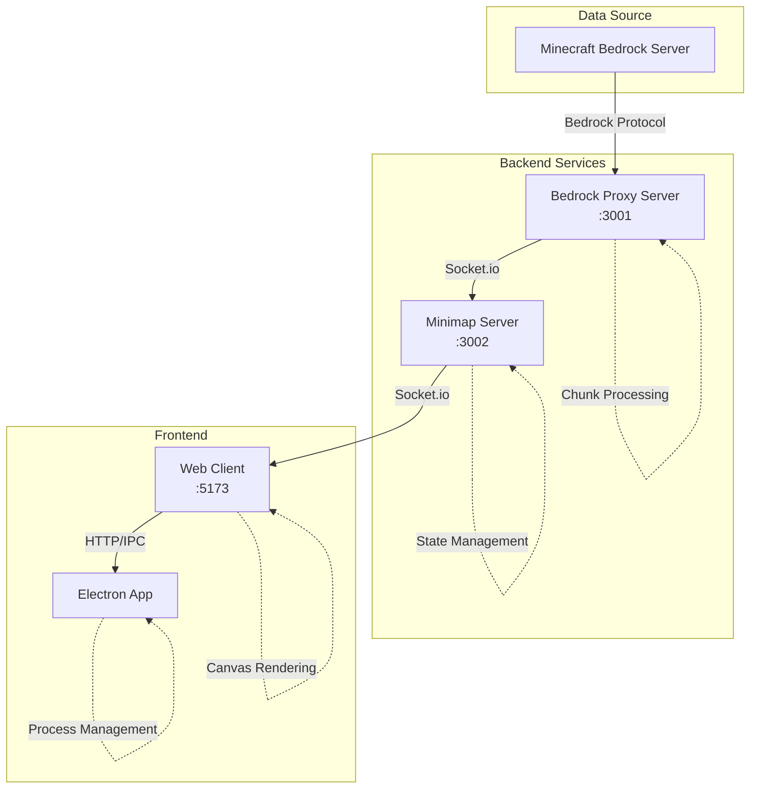
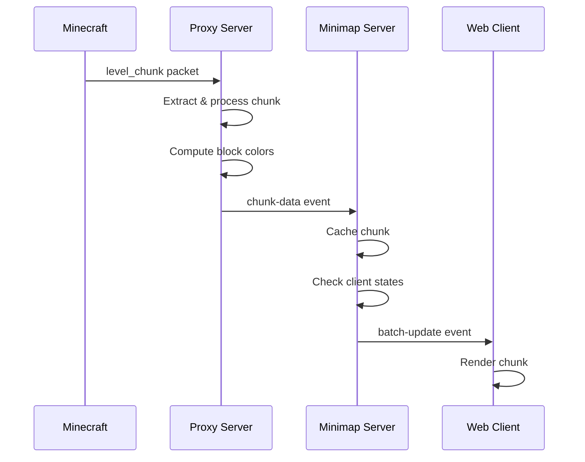
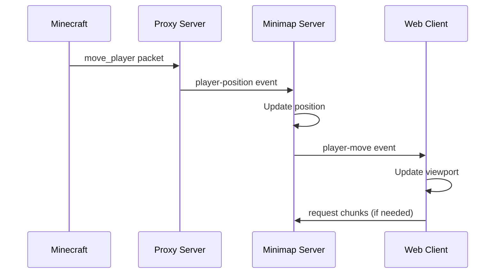

# System Architecture Overview

The Minecraft Bedrock Minimap system is a real-time visualization tool built with a microservices architecture, optimized for performance and scalability.

## Architecture Principles

### Separation of Concerns
Each component has a clearly defined responsibility:
- **Protocol Handling**: Isolated in the proxy server
- **State Management**: Centralized in the minimap server
- **Rendering**: Handled by the web client
- **Desktop Integration**: Managed by the Electron app

### Performance First
- Pre-computed color data reduces client-side processing
- Intelligent batching reduces network traffic by 80%
- Multi-tier caching prevents redundant calculations
- Viewport-based rendering ensures 60 FPS performance

### Type Safety
- Shared TypeScript types ensure consistency
- Zod validation for runtime type checking
- Strict TypeScript configuration throughout

## System Components



## Component Responsibilities

### Bedrock Proxy Server (Port 3001)
**Primary Role**: Protocol bridge between Minecraft and the minimap system

- Connects to Minecraft Bedrock servers using bedrock-protocol
- Extracts chunk data from level_chunk packets
- Computes block colors using height-based algorithms
- Manages ore detection scanning
- Emits processed data via Socket.io

**Key Features**:
- Configurable proxy settings
- Packet simulation for testing
- Dump recording for debugging
- Connection state management

### Minimap Server (Port 3002)
**Primary Role**: State management and client synchronization

- Maintains global chunk cache
- Tracks per-client state to prevent redundant updates
- Implements intelligent update batching
- Handles client subscription management
- Forwards position updates and chunk data

**Key Features**:
- LRU cache with configurable size limits
- Performance monitoring and metrics
- Automatic client state cleanup
- Delta update support

### Web Client (Port 5173)
**Primary Role**: User interface and minimap rendering

- Canvas-based chunk rendering
- Viewport management with smooth scrolling
- Multi-resolution caching system
- Ore detection visualization
- Proxy settings UI

**Key Features**:
- GPU-accelerated rendering with ImageBitmap
- Dirty region tracking for efficiency
- MegaTile grouping for batch rendering
- Configurable render distance

### Electron App
**Primary Role**: Desktop application wrapper

- Process lifecycle management
- Overlay mode for transparent minimap
- Native window controls
- Log aggregation from all services
- Context menu integration

**Key Features**:
- Automatic process restart on failure
- IPC communication with renderer
- Configurable frame modes
- Cross-platform support

## Data Flow

### 1. Chunk Data Flow


### 2. Player Position Flow


## Performance Architecture

### Caching Strategy
```
┌─────────────────────────────────────┐
│         Multi-Tier Cache            │
├─────────────────────────────────────┤
│  L1: Rendered Chunks (Canvas)       │
│  - Per-resolution caching           │
│  - LRU eviction                     │
├─────────────────────────────────────┤
│  L2: Chunk Data (Memory)            │
│  - Color arrays                     │
│  - Height maps                      │
├─────────────────────────────────────┤
│  L3: MegaTiles (GPU)                │
│  - 3x3 or 5x5 chunk groups          │
│  - ImageBitmap acceleration         │
└─────────────────────────────────────┘
```

### Network Optimization
- **Batching**: Updates grouped within 100ms windows
- **Deduplication**: Prevents sending duplicate chunks
- **Delta Updates**: Only changed blocks transmitted
- **Compression**: Socket.io compression enabled

### Rendering Pipeline
```
1. Viewport Calculation
   └─> Determine visible chunks
2. Cache Check
   └─> Use cached canvases if available
3. Chunk Rendering
   └─> Draw missing chunks
4. MegaTile Grouping
   └─> Combine adjacent chunks
5. Dirty Region Update
   └─> Only redraw changed areas
6. Composite
   └─> Final canvas output
```

## Scalability Considerations

### Horizontal Scaling
- Stateless proxy servers can be load balanced
- Minimap server supports multiple instances with Redis
- Client-side rendering distributes processing load

### Resource Management
- Configurable memory limits
- Automatic cache eviction
- Graceful degradation under load
- Performance monitoring and alerts

### Future Considerations
- WebGL rendering for massive worlds
- Web Worker chunk processing
- WebRTC for peer-to-peer updates
- Cloud-based chunk storage

## Security Architecture

### Network Security
- Socket.io authentication support
- CORS configuration for web clients
- Rate limiting on chunk requests

### Process Isolation
- Electron context isolation
- Sandboxed renderer processes
- Secure IPC communication

### Data Validation
- Zod schemas for settings validation
- Type checking at boundaries
- Input sanitization

## Configuration Management

### Environment Variables
Each component uses environment variables for configuration:
- Connection settings (hosts, ports)
- Performance tuning parameters
- Feature flags

### Runtime Configuration
- Proxy settings panel for dynamic updates
- Per-client render settings
- Saved user preferences

### Configuration Flow
```
ENV vars → Component Config → Runtime Settings → User Preferences
```

## Monitoring and Observability

### Metrics Collection
- FPS and render times
- Network traffic volume
- Cache hit rates
- Memory usage

### Logging Strategy
- Structured logging with levels
- Log aggregation in Electron
- Debug mode for development

### Health Checks
- Process heartbeat monitoring
- Automatic restart on failure
- Connection state tracking

## Technology Stack

### Core Technologies
- **Node.js 18+**: Runtime with native TypeScript support
- **TypeScript 5+**: Type-safe development
- **Socket.io**: Real-time communication
- **Electron**: Desktop application framework

### Rendering Stack
- **Canvas API**: 2D graphics
- **OffscreenCanvas**: Background rendering
- **ImageBitmap**: GPU acceleration

### Development Tools
- **Vite**: Fast development server
- **npm workspaces**: Monorepo management
- **tsx**: Direct TypeScript execution

This architecture provides a solid foundation for a performant, scalable, and maintainable minimap system while allowing for future enhancements and optimizations.