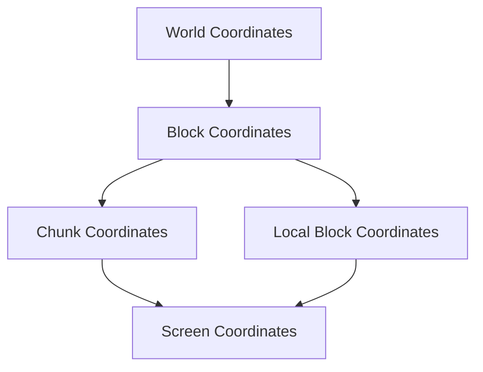

# Coordinate Systems

The Minecraft Bedrock Minimap uses multiple coordinate systems. Understanding how they relate is crucial for proper implementation.

## Overview of Coordinate Systems



## Block Coordinates

### Definition

Block coordinates represent the absolute position of a block in the world.

```typescript
interface BlockPosition {
  x: number;  // East-West axis (East is positive)
  y: number;  // Vertical axis (Up is positive)
  z: number;  // North-South axis (South is positive)
}
```

### Coordinate Ranges

```
X-axis: -30,000,000 to 30,000,000
Y-axis: -64 to 320 (Bedrock Edition 1.18+)
Z-axis: -30,000,000 to 30,000,000
```

### Visual Representation

```
      North (-Z)
          ↑
West ←----┼----→ East
(-X)      │     (+X)
          │
          ↓
      South (+Z)
```

## Chunk Coordinates

### Conversion from Block Coordinates

```typescript
function blockToChunk(blockX: number, blockZ: number): ChunkCoordinate {
  return {
    chunkX: Math.floor(blockX / 16),
    chunkZ: Math.floor(blockZ / 16)
  };
}

// Examples:
// Block (0, 0) → Chunk (0, 0)
// Block (15, 15) → Chunk (0, 0)
// Block (16, 16) → Chunk (1, 1)
// Block (-1, -1) → Chunk (-1, -1)
```

### Chunk Boundaries

```typescript
function getChunkBoundaries(chunkX: number, chunkZ: number): BlockBoundaries {
  return {
    minX: chunkX * 16,
    maxX: chunkX * 16 + 15,
    minZ: chunkZ * 16,
    maxZ: chunkZ * 16 + 15
  };
}
```

## Local Block Coordinates

### Definition

Local coordinates represent a block's position within its chunk (0-15).

```typescript
function getLocalCoordinates(blockX: number, blockZ: number): LocalCoordinate {
  return {
    localX: ((blockX % 16) + 16) % 16,  // Handles negative values
    localZ: ((blockZ % 16) + 16) % 16
  };
}

// Convert to array index
function getBlockIndex(localX: number, localZ: number): number {
  return localX + localZ * 16;  // 0-255
}
```

### Conversion Table

| Block Coord | Chunk Coord | Local Coord |
|-------------|-------------|-------------|
| 0           | 0           | 0           |
| 15          | 0           | 15          |
| 16          | 1           | 0           |
| -1          | -1          | 15          |
| -16         | -1          | 0           |
| -17         | -2          | 15          |

## Screen Coordinates

### Canvas Coordinate System

The minimap uses standard canvas coordinates:

```
(0,0) ────────→ X (width)
  │
  │
  ↓
  Y (height)
```

### World to Screen Conversion

```typescript
class CoordinateConverter {
  constructor(
    private viewport: Viewport,
    private blockSize: number = 4  // Pixels per block
  ) {}
  
  worldToScreen(worldX: number, worldZ: number): ScreenCoordinate {
    // Center-relative positioning
    const relativeX = worldX - this.viewport.centerX;
    const relativeZ = worldZ - this.viewport.centerZ;
    
    // Apply zoom and convert to pixels
    const screenX = relativeX * this.blockSize * this.viewport.zoom;
    const screenZ = relativeZ * this.blockSize * this.viewport.zoom;
    
    // Translate to canvas coordinates
    return {
      x: this.viewport.width / 2 + screenX,
      y: this.viewport.height / 2 + screenZ
    };
  }
  
  screenToWorld(screenX: number, screenY: number): WorldCoordinate {
    // Reverse the transformation
    const relativeX = (screenX - this.viewport.width / 2) / (this.blockSize * this.viewport.zoom);
    const relativeZ = (screenY - this.viewport.height / 2) / (this.blockSize * this.viewport.zoom);
    
    return {
      x: Math.floor(this.viewport.centerX + relativeX),
      z: Math.floor(this.viewport.centerZ + relativeZ)
    };
  }
}
```

## Viewport Management

### Viewport Definition

```typescript
interface Viewport {
  centerX: number;     // World X coordinate at center
  centerZ: number;     // World Z coordinate at center
  width: number;       // Canvas width in pixels
  height: number;      // Canvas height in pixels
  zoom: number;        // Zoom level (0.5 - 4.0)
  dimension: number;   // Current dimension
}
```

### Visible Area Calculation

```typescript
function getVisibleBounds(viewport: Viewport, blockSize: number): WorldBounds {
  const blocksWide = viewport.width / (blockSize * viewport.zoom);
  const blocksHigh = viewport.height / (blockSize * viewport.zoom);
  
  return {
    minX: Math.floor(viewport.centerX - blocksWide / 2),
    maxX: Math.ceil(viewport.centerX + blocksWide / 2),
    minZ: Math.floor(viewport.centerZ - blocksHigh / 2),
    maxZ: Math.ceil(viewport.centerZ + blocksHigh / 2)
  };
}

function getVisibleChunks(viewport: Viewport, blockSize: number): Set<ChunkKey> {
  const bounds = getVisibleBounds(viewport, blockSize);
  const chunks = new Set<ChunkKey>();
  
  const minChunkX = Math.floor(bounds.minX / 16);
  const maxChunkX = Math.ceil(bounds.maxX / 16);
  const minChunkZ = Math.floor(bounds.minZ / 16);
  const maxChunkZ = Math.ceil(bounds.maxZ / 16);
  
  for (let x = minChunkX; x <= maxChunkX; x++) {
    for (let z = minChunkZ; z <= maxChunkZ; z++) {
      chunks.add(getChunkKey(x, z, viewport.dimension));
    }
  }
  
  return chunks;
}
```

## Coordinate Utilities

### Distance Calculations

```typescript
// Euclidean distance between blocks
function blockDistance(a: BlockPosition, b: BlockPosition): number {
  const dx = a.x - b.x;
  const dz = a.z - b.z;
  return Math.sqrt(dx * dx + dz * dz);
}

// Manhattan distance (taxicab)
function manhattanDistance(a: BlockPosition, b: BlockPosition): number {
  return Math.abs(a.x - b.x) + Math.abs(a.z - b.z);
}

// Chunk distance
function chunkDistance(a: ChunkCoordinate, b: ChunkCoordinate): number {
  const dx = a.x - b.x;
  const dz = a.z - b.z;
  return Math.sqrt(dx * dx + dz * dz);
}
```

### Boundary Checks

```typescript
class BoundaryChecker {
  isBlockInChunk(blockX: number, blockZ: number, chunkX: number, chunkZ: number): boolean {
    const localX = blockX - chunkX * 16;
    const localZ = blockZ - chunkZ * 16;
    return localX >= 0 && localX < 16 && localZ >= 0 && localZ < 16;
  }
  
  isChunkVisible(chunkX: number, chunkZ: number, viewport: Viewport): boolean {
    const chunkScreenX = (chunkX * 16 - viewport.centerX) * this.blockSize * viewport.zoom;
    const chunkScreenZ = (chunkZ * 16 - viewport.centerZ) * this.blockSize * viewport.zoom;
    
    const chunkSize = 16 * this.blockSize * viewport.zoom;
    
    return Math.abs(chunkScreenX) < viewport.width / 2 + chunkSize &&
           Math.abs(chunkScreenZ) < viewport.height / 2 + chunkSize;
  }
}
```

## Special Cases

### Negative Coordinates

JavaScript's modulo operator requires special handling for negative numbers:

```typescript
// Incorrect for negative values
const localX = blockX % 16;  // -1 % 16 = -1 (not 15!)

// Correct handling
const localX = ((blockX % 16) + 16) % 16;  // -1 → 15
```

### Dimension Scaling

Different dimensions may have different coordinate scales:

```typescript
function translateCoordinateBetweenDimensions(
  coord: BlockPosition,
  fromDim: Dimension,
  toDim: Dimension
): BlockPosition {
  // Nether to Overworld: multiply by 8
  if (fromDim === Dimension.NETHER && toDim === Dimension.OVERWORLD) {
    return {
      x: coord.x * 8,
      y: coord.y,
      z: coord.z * 8
    };
  }
  
  // Overworld to Nether: divide by 8
  if (fromDim === Dimension.OVERWORLD && toDim === Dimension.NETHER) {
    return {
      x: Math.floor(coord.x / 8),
      y: coord.y,
      z: Math.floor(coord.z / 8)
    };
  }
  
  // No scaling for other transitions
  return coord;
}
```

## Performance Considerations

### Coordinate Caching

```typescript
class CoordinateCache {
  private blockToChunkCache = new Map<string, ChunkCoordinate>();
  
  getChunkCoordinate(blockX: number, blockZ: number): ChunkCoordinate {
    const key = `${blockX},${blockZ}`;
    
    if (!this.blockToChunkCache.has(key)) {
      this.blockToChunkCache.set(key, {
        x: Math.floor(blockX / 16),
        z: Math.floor(blockZ / 16)
      });
    }
    
    return this.blockToChunkCache.get(key)!;
  }
}
```

### Batch Conversions

```typescript
function batchWorldToScreen(
  positions: WorldPosition[],
  viewport: Viewport,
  blockSize: number
): ScreenPosition[] {
  // Pre-calculate common values
  const scale = blockSize * viewport.zoom;
  const offsetX = viewport.width / 2 - viewport.centerX * scale;
  const offsetZ = viewport.height / 2 - viewport.centerZ * scale;
  
  return positions.map(pos => ({
    x: pos.x * scale + offsetX,
    y: pos.z * scale + offsetZ
  }));
}
```

## Common Pitfalls

### 1. Integer Division

```typescript
// Wrong: Uses floating point
const chunkX = blockX / 16;  // 15 / 16 = 0.9375

// Correct: Uses integer division
const chunkX = Math.floor(blockX / 16);  // 15 / 16 = 0
```

### 2. Chunk Boundary Edge Cases

```typescript
// Check if block is on chunk boundary
function isOnChunkBoundary(blockX: number, blockZ: number): boolean {
  return (blockX % 16 === 0) || (blockZ % 16 === 0);
}
```

### 3. Zoom Level Precision

```typescript
// Avoid accumulating rounding errors
class ZoomManager {
  private baseBlockSize = 4;
  private zoomLevels = [0.5, 1, 2, 4];  // Discrete levels
  
  getBlockSize(zoomIndex: number): number {
    return this.baseBlockSize * this.zoomLevels[zoomIndex];
  }
}
```

Understanding these coordinate systems and their relationships is essential for accurate minimap rendering and interaction handling.