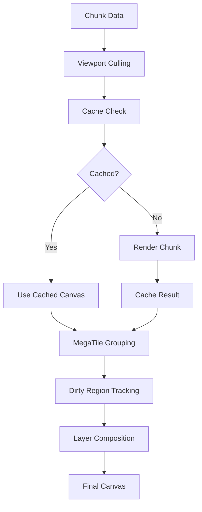

# Rendering Pipeline

The minimap rendering pipeline is a multi-stage process optimized for performance and visual quality. This document explains each stage and the techniques used.

## Pipeline Overview



## Stage 1: Viewport Culling

Only process chunks that are visible or near-visible:

```typescript
class ViewportCuller {
  private bufferChunks = 2; // Extra chunks around viewport
  
  getVisibleChunks(viewport: Viewport): Set<ChunkKey> {
    const visible = new Set<ChunkKey>();
    
    // Calculate world bounds with buffer
    const worldBounds = this.getWorldBounds(viewport);
    const buffer = this.bufferChunks * 16;
    
    const minChunkX = Math.floor((worldBounds.minX - buffer) / 16);
    const maxChunkX = Math.ceil((worldBounds.maxX + buffer) / 16);
    const minChunkZ = Math.floor((worldBounds.minZ - buffer) / 16);
    const maxChunkZ = Math.ceil((worldBounds.maxZ + buffer) / 16);
    
    // Add visible chunks
    for (let x = minChunkX; x <= maxChunkX; x++) {
      for (let z = minChunkZ; z <= maxChunkZ; z++) {
        const distance = this.chunkDistanceFromCenter(x, z, viewport);
        
        // Circular culling for better performance
        if (distance <= viewport.renderDistance) {
          visible.add(getChunkKey(x, z, viewport.dimension));
        }
      }
    }
    
    return visible;
  }
}
```

## Stage 2: Multi-Level Caching

### Cache Hierarchy

```typescript
class RenderCache {
  // L1: Rendered canvases at different resolutions
  private canvasCache = new Map<string, CanvasCache>();
  
  // L2: Raw chunk data
  private dataCache = new Map<string, ChunkData>();
  
  // L3: GPU-accelerated bitmaps
  private bitmapCache = new Map<string, ImageBitmap>();
  
  getCachedRender(
    chunkKey: string,
    resolution: number
  ): HTMLCanvasElement | null {
    // Check canvas cache first
    const cached = this.canvasCache.get(chunkKey);
    if (cached?.hasResolution(resolution)) {
      cached.lastAccess = Date.now();
      return cached.getCanvas(resolution);
    }
    
    // Check if we can generate from bitmap
    const bitmap = this.bitmapCache.get(chunkKey);
    if (bitmap) {
      return this.renderFromBitmap(bitmap, resolution);
    }
    
    return null;
  }
}
```

### Resolution Selection

```typescript
class ResolutionManager {
  private resolutions = [64, 128, 256]; // Pixels per chunk
  
  selectResolution(
    viewport: Viewport,
    performanceMetrics: PerformanceMetrics
  ): number {
    const baseResolution = Math.ceil(16 * viewport.zoom * viewport.blockSize);
    
    // Adjust based on performance
    if (performanceMetrics.fps < 30) {
      // Use lower resolution
      return this.resolutions[0];
    } else if (performanceMetrics.fps < 50) {
      // Use medium resolution
      return this.resolutions[1];
    }
    
    // Find best matching resolution
    return this.resolutions.find(r => r >= baseResolution) || 256;
  }
}
```

## Stage 3: Chunk Rendering

### Basic Chunk Rendering

```typescript
class ChunkRenderer {
  renderChunk(
    chunk: ChunkData,
    blockSize: number,
    options: RenderOptions = {}
  ): HTMLCanvasElement {
    const size = 16 * blockSize;
    const canvas = document.createElement('canvas');
    canvas.width = size;
    canvas.height = size;
    
    const ctx = canvas.getContext('2d', {
      alpha: false,
      desynchronized: true
    })!;
    
    // Disable smoothing for pixel-perfect rendering
    ctx.imageSmoothingEnabled = false;
    
    // Use color batching for performance
    const batcher = new ColorBatcher();
    
    // Process all blocks
    for (let x = 0; x < 16; x++) {
      for (let z = 0; z < 16; z++) {
        const index = x + z * 16;
        const color = chunk.colors.slice(index * 3, index * 3 + 3);
        const colorStr = `rgb(${color[0]},${color[1]},${color[2]})`;
        
        batcher.addBlock(x, z, colorStr);
      }
    }
    
    // Render batched colors
    batcher.render(ctx, blockSize);
    
    // Apply optional overlays
    if (options.showGrid) {
      this.renderGrid(ctx, size);
    }
    
    if (options.oreHighlights && chunk.ores) {
      this.renderOres(ctx, chunk.ores, blockSize, options);
    }
    
    return canvas;
  }
}
```

### Ore Highlighting

```typescript
private renderOres(
  ctx: CanvasRenderingContext2D,
  ores: OreLocation[],
  blockSize: number,
  options: RenderOptions
): void {
  const { oreDetection } = options;
  
  // Sort by priority (render important ores last)
  const sorted = ores.sort((a, b) => 
    getOrePriority(a.oreType) - getOrePriority(b.oreType)
  );
  
  for (const ore of sorted) {
    const config = oreDetection.oreTypes[ore.oreType];
    if (!config?.enabled) continue;
    
    const x = ore.x * blockSize;
    const y = ore.z * blockSize;
    
    // Apply highlight style
    switch (oreDetection.highlightStyle) {
      case 'glow':
        this.renderGlow(ctx, x, y, blockSize, config.color);
        break;
        
      case 'bright':
        ctx.fillStyle = config.color;
        ctx.fillRect(x, y, blockSize, blockSize);
        break;
        
      case 'outline':
        ctx.strokeStyle = config.color;
        ctx.lineWidth = Math.max(1, blockSize / 8);
        ctx.strokeRect(x, y, blockSize, blockSize);
        break;
    }
  }
}

private renderGlow(
  ctx: CanvasRenderingContext2D,
  x: number,
  y: number,
  size: number,
  color: string
): void {
  const gradient = ctx.createRadialGradient(
    x + size/2, y + size/2, 0,
    x + size/2, y + size/2, size
  );
  
  gradient.addColorStop(0, color + 'FF');
  gradient.addColorStop(0.5, color + '80');
  gradient.addColorStop(1, color + '00');
  
  ctx.fillStyle = gradient;
  ctx.fillRect(x - size/2, y - size/2, size * 2, size * 2);
}
```

## Stage 4: MegaTile Optimization

Group adjacent chunks for batch rendering:

```typescript
class MegaTileRenderer {
  private tileSize = 3; // 3x3 chunks by default
  
  async createMegaTile(
    centerChunkX: number,
    centerChunkZ: number,
    chunks: Map<ChunkKey, ChunkData>,
    blockSize: number
  ): Promise<MegaTile> {
    const pixelSize = this.tileSize * 16 * blockSize;
    const canvas = new OffscreenCanvas(pixelSize, pixelSize);
    const ctx = canvas.getContext('2d')!;
    
    // Render all chunks in the tile
    const halfSize = Math.floor(this.tileSize / 2);
    
    for (let dx = -halfSize; dx <= halfSize; dx++) {
      for (let dz = -halfSize; dz <= halfSize; dz++) {
        const chunkX = centerChunkX + dx;
        const chunkZ = centerChunkZ + dz;
        const chunkKey = getChunkKey(chunkX, chunkZ, 0);
        
        const chunk = chunks.get(chunkKey);
        if (chunk) {
          const chunkCanvas = this.renderChunk(chunk, blockSize);
          const x = (dx + halfSize) * 16 * blockSize;
          const z = (dz + halfSize) * 16 * blockSize;
          
          ctx.drawImage(chunkCanvas, x, z);
        }
      }
    }
    
    // Convert to ImageBitmap for GPU acceleration
    const bitmap = await createImageBitmap(canvas, {
      premultiplyAlpha: 'none',
      colorSpaceConversion: 'none'
    });
    
    return {
      centerX: centerChunkX,
      centerZ: centerChunkZ,
      dimension: 0,
      size: this.tileSize,
      bitmap,
      lastUpdate: Date.now(),
      chunks: new Set([...chunks.keys()])
    };
  }
}
```

## Stage 5: Dirty Region Tracking

Only update changed areas:

```typescript
class DirtyRegionTracker {
  private regions: DirtyRegion[] = [];
  private fullRedraw = false;
  
  markChunkDirty(chunkX: number, chunkZ: number, viewport: Viewport): void {
    // Convert chunk to screen coordinates
    const screen = this.chunkToScreen(chunkX, chunkZ, viewport);
    
    if (screen) {
      this.regions.push({
        x: screen.x,
        y: screen.y,
        width: screen.width,
        height: screen.height,
        timestamp: Date.now()
      });
    }
  }
  
  optimizeRegions(): DirtyRegion[] | null {
    if (this.fullRedraw) return null;
    
    // Merge overlapping regions
    const merged = this.mergeRegions(this.regions);
    
    // If too many regions, do full redraw
    if (merged.length > 20) {
      this.fullRedraw = true;
      return null;
    }
    
    return merged;
  }
  
  private mergeRegions(regions: DirtyRegion[]): DirtyRegion[] {
    if (regions.length <= 1) return regions;
    
    const merged: DirtyRegion[] = [];
    const sorted = [...regions].sort((a, b) => a.x - b.x || a.y - b.y);
    
    let current = sorted[0];
    
    for (let i = 1; i < sorted.length; i++) {
      const next = sorted[i];
      
      if (this.intersects(current, next)) {
        // Merge regions
        current = {
          x: Math.min(current.x, next.x),
          y: Math.min(current.y, next.y),
          width: Math.max(current.x + current.width, next.x + next.width) - 
                 Math.min(current.x, next.x),
          height: Math.max(current.y + current.height, next.y + next.height) - 
                  Math.min(current.y, next.y),
          timestamp: Math.max(current.timestamp, next.timestamp)
        };
      } else {
        merged.push(current);
        current = next;
      }
    }
    
    merged.push(current);
    return merged;
  }
}
```

## Stage 6: Layer Composition

### Three-Layer System

```typescript
class LayeredRenderer {
  private layers: Map<LayerType, Layer> = new Map();
  
  constructor(width: number, height: number) {
    // Base layer: terrain (rarely changes)
    this.createLayer('base', width, height, 1);
    
    // Update layer: recent changes
    this.createLayer('updates', width, height, 2);
    
    // Overlay layer: UI elements, player, grid
    this.createLayer('overlay', width, height, 3);
  }
  
  private createLayer(
    name: LayerType,
    width: number,
    height: number,
    zIndex: number
  ): void {
    const canvas = document.createElement('canvas');
    canvas.width = width;
    canvas.height = height;
    
    this.layers.set(name, {
      name,
      canvas,
      ctx: canvas.getContext('2d')!,
      dirty: true,
      zIndex
    });
  }
  
  composite(targetCtx: CanvasRenderingContext2D): void {
    // Clear target
    targetCtx.clearRect(0, 0, targetCtx.canvas.width, targetCtx.canvas.height);
    
    // Composite layers in order
    const sorted = Array.from(this.layers.values())
      .sort((a, b) => a.zIndex - b.zIndex);
    
    for (const layer of sorted) {
      if (layer.visible) {
        targetCtx.globalAlpha = layer.opacity || 1;
        targetCtx.drawImage(layer.canvas, 0, 0);
      }
    }
    
    targetCtx.globalAlpha = 1;
  }
}
```

## Stage 7: Final Rendering

### Main Render Loop

```typescript
class MinimapRenderer {
  private animationFrameId?: number;
  private lastFrameTime = 0;
  
  startRenderLoop(): void {
    const render = (timestamp: number) => {
      // Calculate delta time
      const deltaTime = timestamp - this.lastFrameTime;
      this.lastFrameTime = timestamp;
      
      // Update performance metrics
      this.performanceMonitor.recordFrame(deltaTime);
      
      // Check if render needed
      if (this.shouldRender()) {
        this.render();
      }
      
      // Continue loop
      this.animationFrameId = requestAnimationFrame(render);
    };
    
    this.animationFrameId = requestAnimationFrame(render);
  }
  
  private render(): void {
    const startTime = performance.now();
    
    // Get dirty regions
    const dirtyRegions = this.dirtyTracker.getRegions();
    
    if (!dirtyRegions) {
      // Full render
      this.renderFull();
    } else if (dirtyRegions.length > 0) {
      // Partial render
      this.renderPartial(dirtyRegions);
    }
    
    // Update UI overlay
    this.renderOverlay();
    
    // Composite layers
    this.layeredRenderer.composite(this.mainCtx);
    
    // Record render time
    const renderTime = performance.now() - startTime;
    this.performanceMonitor.recordRenderTime(renderTime);
  }
}
```

## Performance Monitoring

### Render Statistics

```typescript
class RenderStats {
  private frameCount = 0;
  private totalRenderTime = 0;
  private drawCallCount = 0;
  
  recordFrame(renderTime: number, drawCalls: number): void {
    this.frameCount++;
    this.totalRenderTime += renderTime;
    this.drawCallCount += drawCalls;
  }
  
  getStats(): RenderStatistics {
    return {
      fps: this.calculateFPS(),
      avgRenderTime: this.totalRenderTime / this.frameCount,
      avgDrawCalls: this.drawCallCount / this.frameCount,
      totalFrames: this.frameCount
    };
  }
}
```

## Optimization Techniques

### 1. Batch Rendering
- Group similar operations
- Minimize state changes
- Use sprite sheets for UI elements

### 2. Culling Strategies
- Frustum culling for off-screen chunks
- Occlusion culling for hidden areas
- Level-of-detail (LOD) for distant chunks

### 3. GPU Acceleration
- Use ImageBitmap for hardware acceleration
- Leverage OffscreenCanvas for parallel rendering
- Consider WebGL for future improvements

### 4. Memory Management
- Pool canvas objects
- Limit cache sizes
- Dispose unused resources

## Future Enhancements

### WebGL Rendering
- Massive performance improvements
- Advanced shading effects
- Instanced rendering for repeated elements

### Web Workers
- Offload chunk processing
- Parallel rendering pipelines
- Background cache management

### Progressive Enhancement
- Start with low quality
- Incrementally improve detail
- Adaptive quality based on device

The rendering pipeline balances performance and visual quality through careful optimization at each stage, ensuring smooth 60 FPS performance even with large worlds.