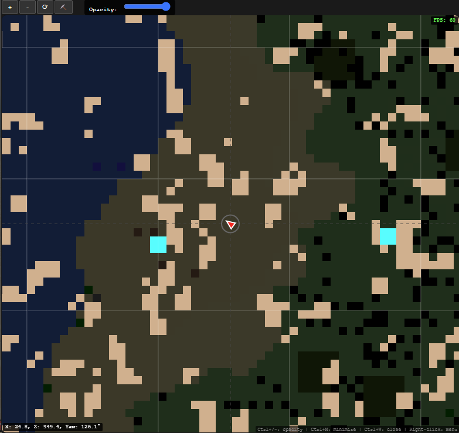
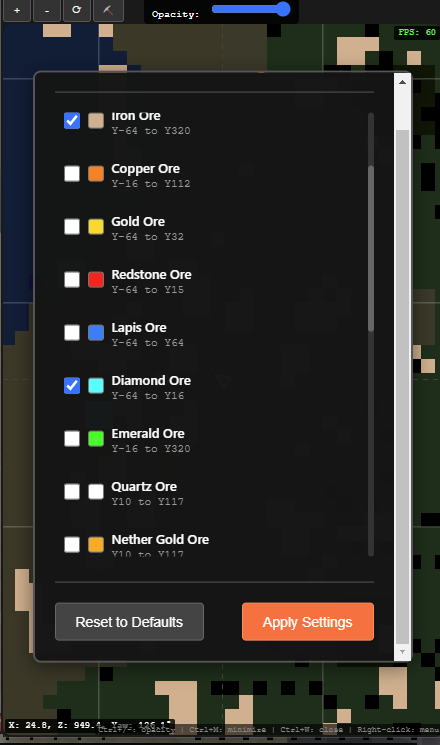
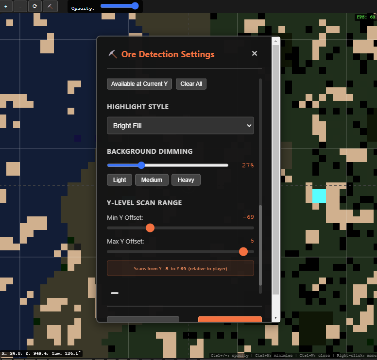

# Gallery

Visual showcase of the Minecraft Bedrock Minimap features and user interface.

## Minimap in Action

### Overlay Mode

*The minimap running as a transparent overlay while playing Minecraft Bedrock Edition. The minimap appears in the top-right corner showing real-time terrain and player position.*

### Ore Detection

*Minimap displaying ore detection with cyan highlights marking diamond and iron ore locations. The player marker (red triangle) is visible at the center, with coordinates shown at the bottom.*

## User Interface

### Ore Type Configuration

*Ore detection settings panel showing individual ore type toggles. Each ore type displays its Y-level range (e.g., Iron Ore Y-64 to Y320). Users can enable/disable specific ore types with checkboxes.*

### Advanced Ore Settings

*Detailed ore detection configuration including:*
- *Highlight Style: Bright Fill, Glow, or Outline options*
- *Background Dimming: Adjustable slider (27% shown)*
- *Y-Level Scan Range: Configurable Min/Max Y offsets relative to player position*
- *Quick presets: Light, Medium, Heavy dimming levels*

## Key Features Demonstrated

### Real-Time Rendering
- **Chunk Loading**: Seamless terrain visualization as chunks load
- **Player Tracking**: Real-time position updates with smooth movement
- **Performance**: Smooth 60 FPS rendering even with ore detection enabled

### Ore Detection System
- **11 Ore Types**: Support for all major ores including Ancient Debris
- **Y-Level Filtering**: Configurable scan range relative to player position
- **Visual Highlighting**: Multiple highlight styles for different preferences
- **Background Dimming**: Adjustable terrain dimming to make ores stand out

### Overlay Integration
- **Transparent Window**: Configurable opacity (30-100%)
- **Always on Top**: Perfect for gaming without alt-tabbing
- **Minimal Footprint**: Compact overlay that doesn't obstruct gameplay
- **Native Controls**: Window management through context menu

### User Experience
- **Intuitive Controls**: Easy-to-use settings panels
- **Visual Feedback**: Clear coordinate display and FPS counter
- **Responsive Design**: Settings update in real-time
- **Performance Monitoring**: Built-in performance metrics

This gallery showcases the comprehensive feature set and polished user interface of the Minecraft Bedrock Minimap system, demonstrating its capability as both a development tool and gaming enhancement.