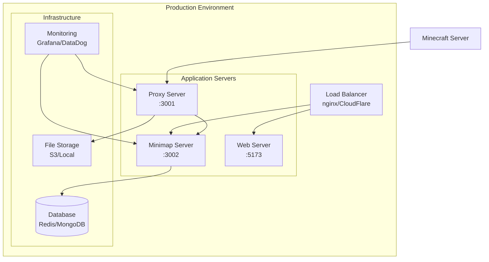

# Deployment Guide

This guide covers deployment strategies and configurations for the Minecraft Bedrock Minimap in production environments.

## Deployment Overview

### Deployment Architecture



### Deployment Options

1. **Single Server**: All services on one machine
2. **Multi-Server**: Services distributed across servers
3. **Container**: Docker/Kubernetes deployment
4. **Cloud**: AWS/GCP/Azure deployment
5. **Electron**: Desktop application distribution

## Production Build

### Build Process

```bash
# Clean previous builds
npm run clean

# Install production dependencies
npm ci --production

# Build all packages
npm run build

# Verify builds
npm run typecheck
npm run test
```

### Build Optimization

```javascript
// vite.config.ts - Production optimizations
export default {
  build: {
    target: 'es2020',
    minify: 'terser',
    sourcemap: false,
    rollupOptions: {
      output: {
        manualChunks: {
          vendor: ['socket.io-client'],
          utils: ['@minecraft-bedrock-minimap/shared']
        }
      }
    }
  },
  define: {
    __DEV__: false,
    __VERSION__: JSON.stringify(process.env.npm_package_version)
  }
};
```

## Single Server Deployment

### Prerequisites

```bash
# System requirements
# - Ubuntu 20.04+ / CentOS 8+ / Windows Server 2019+
# - Node.js 18.0.0+
# - 4GB RAM minimum, 8GB recommended
# - 20GB storage minimum

# Install Node.js
curl -fsSL https://deb.nodesource.com/setup_18.x | sudo -E bash -
sudo apt-get install -y nodejs

# Install PM2 process manager
npm install -g pm2
```

### Process Manager Configuration

```javascript
// ecosystem.config.js
module.exports = {
  apps: [
    {
      name: 'bedrock-proxy',
      script: './packages/bedrock-proxy-server/dist/index.js',
      cwd: '/opt/minimap',
      instances: 1,
      autorestart: true,
      watch: false,
      max_memory_restart: '1G',
      env: {
        NODE_ENV: 'production',
        PORT: 3001,
        MC_SERVER_HOST: 'your.minecraft.server.com',
        MC_SERVER_PORT: 19132
      },
      error_file: '/var/log/minimap/proxy-error.log',
      out_file: '/var/log/minimap/proxy-out.log',
      log_file: '/var/log/minimap/proxy.log'
    },
    {
      name: 'minimap-server',
      script: './packages/minimap-server/dist/index.js',
      cwd: '/opt/minimap',
      instances: 1,
      autorestart: true,
      watch: false,
      max_memory_restart: '2G',
      env: {
        NODE_ENV: 'production',
        PORT: 3002,
        PROXY_URL: 'http://localhost:3001',
        CHUNK_CACHE_SIZE: 100000
      },
      error_file: '/var/log/minimap/minimap-error.log',
      out_file: '/var/log/minimap/minimap-out.log',
      log_file: '/var/log/minimap/minimap.log'
    }
  ]
};
```

### Nginx Configuration

```nginx
# /etc/nginx/sites-available/minimap
server {
    listen 80;
    server_name minimap.yourserver.com;
    
    # Redirect HTTP to HTTPS
    return 301 https://$server_name$request_uri;
}

server {
    listen 443 ssl http2;
    server_name minimap.yourserver.com;
    
    # SSL Configuration
    ssl_certificate /path/to/ssl/cert.pem;
    ssl_certificate_key /path/to/ssl/private.key;
    ssl_protocols TLSv1.2 TLSv1.3;
    ssl_ciphers ECDHE-RSA-AES256-GCM-SHA512:DHE-RSA-AES256-GCM-SHA512;
    
    # Security headers
    add_header X-Frame-Options DENY;
    add_header X-Content-Type-Options nosniff;
    add_header X-XSS-Protection "1; mode=block";
    add_header Strict-Transport-Security "max-age=31536000; includeSubDomains";
    
    # Gzip compression
    gzip on;
    gzip_vary on;
    gzip_min_length 1024;
    gzip_types text/plain text/css application/json application/javascript text/xml application/xml application/xml+rss text/javascript;
    
    # Static files
    location / {
        root /opt/minimap/packages/minimap-web-server/dist;
        try_files $uri $uri/ /index.html;
        
        # Cache static assets
        location ~* \.(js|css|png|jpg|jpeg|gif|ico|svg|woff|woff2)$ {
            expires 1y;
            add_header Cache-Control "public, immutable";
        }
    }
    
    # Proxy minimap server
    location /minimap-api/ {
        proxy_pass http://127.0.0.1:3002/;
        proxy_http_version 1.1;
        proxy_set_header Upgrade $http_upgrade;
        proxy_set_header Connection 'upgrade';
        proxy_set_header Host $host;
        proxy_set_header X-Real-IP $remote_addr;
        proxy_set_header X-Forwarded-For $proxy_add_x_forwarded_for;
        proxy_set_header X-Forwarded-Proto $scheme;
        proxy_cache_bypass $http_upgrade;
        
        # WebSocket support
        proxy_read_timeout 86400;
    }
    
    # Proxy health checks
    location /health {
        proxy_pass http://127.0.0.1:3002/health;
        access_log off;
    }
}
```

### System Service

```bash
# /etc/systemd/system/minimap.service
[Unit]
Description=Minecraft Bedrock Minimap
After=network.target

[Service]
Type=forking
User=minimap
WorkingDirectory=/opt/minimap
ExecStart=/usr/bin/pm2 start ecosystem.config.js --env production
ExecReload=/usr/bin/pm2 reload all
ExecStop=/usr/bin/pm2 kill
Restart=always

[Install]
WantedBy=multi-user.target
```

### Deployment Script

```bash
#!/bin/bash
# deploy.sh

set -e

APP_DIR="/opt/minimap"
BACKUP_DIR="/opt/minimap-backup-$(date +%Y%m%d-%H%M%S)"
GITHUB_REPO="your-org/minecraft-bedrock-minimap"
BRANCH="main"

echo "Starting deployment..."

# Create backup
if [ -d "$APP_DIR" ]; then
    echo "Creating backup..."
    sudo cp -r "$APP_DIR" "$BACKUP_DIR"
fi

# Clone/update repository
if [ ! -d "$APP_DIR" ]; then
    echo "Cloning repository..."
    sudo git clone "https://github.com/$GITHUB_REPO.git" "$APP_DIR"
else
    echo "Updating repository..."
    cd "$APP_DIR"
    sudo git fetch origin
    sudo git reset --hard "origin/$BRANCH"
fi

cd "$APP_DIR"

# Install dependencies and build
echo "Installing dependencies..."
sudo npm ci --production

echo "Building application..."
sudo npm run build

# Update permissions
sudo chown -R minimap:minimap "$APP_DIR"

# Restart services
echo "Restarting services..."
sudo systemctl reload minimap

# Health check
echo "Performing health check..."
sleep 10

if curl -f http://localhost:3002/health; then
    echo "Deployment successful!"
else
    echo "Health check failed, rolling back..."
    sudo systemctl stop minimap
    sudo rm -rf "$APP_DIR"
    sudo mv "$BACKUP_DIR" "$APP_DIR"
    sudo systemctl start minimap
    exit 1
fi

# Cleanup old backups (keep last 5)
find /opt -name "minimap-backup-*" -type d | sort | head -n -5 | xargs sudo rm -rf

echo "Deployment completed successfully!"
```

## Docker Deployment

### Multi-Stage Dockerfile

```dockerfile
# Build stage
FROM node:18-alpine AS builder

WORKDIR /app

# Copy package files
COPY package*.json ./
COPY packages/*/package*.json ./packages/*/

# Install dependencies
RUN npm ci

# Copy source code
COPY . .

# Build application
RUN npm run build

# Production stage
FROM node:18-alpine AS production

WORKDIR /app

# Create non-root user
RUN addgroup -g 1001 -S nodejs
RUN adduser -S minimap -u 1001

# Copy package files
COPY package*.json ./
COPY packages/*/package*.json ./packages/*/

# Install production dependencies
RUN npm ci --production && npm cache clean --force

# Copy built application
COPY --from=builder --chown=minimap:nodejs /app/packages/*/dist ./packages/*/dist
COPY --from=builder --chown=minimap:nodejs /app/packages/minimap-web-server/dist ./public

# Switch to non-root user
USER minimap

# Health check
HEALTHCHECK --interval=30s --timeout=10s --start-period=5s --retries=3 \
  CMD node healthcheck.js

# Expose ports
EXPOSE 3001 3002 19134

# Start application
CMD ["npm", "start"]
```

### Docker Compose

```yaml
# docker-compose.yml
version: '3.8'

services:
  redis:
    image: redis:7-alpine
    restart: unless-stopped
    volumes:
      - redis_data:/data
    networks:
      - minimap-network

  proxy-server:
    build: .
    restart: unless-stopped
    ports:
      - "3001:3001"
      - "19134:19134"
    environment:
      - NODE_ENV=production
      - REDIS_URL=redis://redis:6379
      - MC_SERVER_HOST=${MC_SERVER_HOST}
      - MC_SERVER_PORT=${MC_SERVER_PORT}
    depends_on:
      - redis
    networks:
      - minimap-network
    volumes:
      - ./logs:/app/logs
      - chunk_cache:/app/cache

  minimap-server:
    build: .
    restart: unless-stopped
    ports:
      - "3002:3002"
    environment:
      - NODE_ENV=production
      - REDIS_URL=redis://redis:6379
      - PROXY_URL=http://proxy-server:3001
    depends_on:
      - redis
      - proxy-server
    networks:
      - minimap-network
    volumes:
      - ./logs:/app/logs

  nginx:
    image: nginx:alpine
    restart: unless-stopped
    ports:
      - "80:80"
      - "443:443"
    volumes:
      - ./nginx.conf:/etc/nginx/nginx.conf
      - ./ssl:/etc/nginx/ssl
    depends_on:
      - minimap-server
    networks:
      - minimap-network

volumes:
  redis_data:
  chunk_cache:

networks:
  minimap-network:
    driver: bridge
```

## Cloud Deployment

### AWS Deployment

#### ECS Task Definition

```json
{
  "family": "minimap-task",
  "networkMode": "awsvpc",
  "requiresCompatibilities": ["FARGATE"],
  "cpu": "1024",
  "memory": "2048",
  "executionRoleArn": "arn:aws:iam::account:role/ecsTaskExecutionRole",
  "taskRoleArn": "arn:aws:iam::account:role/ecsTaskRole",
  "containerDefinitions": [
    {
      "name": "minimap-app",
      "image": "your-account.dkr.ecr.region.amazonaws.com/minimap:latest",
      "portMappings": [
        {
          "containerPort": 3001,
          "protocol": "tcp"
        },
        {
          "containerPort": 3002,
          "protocol": "tcp"
        }
      ],
      "environment": [
        {
          "name": "NODE_ENV",
          "value": "production"
        },
        {
          "name": "REDIS_URL",
          "value": "redis://elasticache-cluster:6379"
        }
      ],
      "secrets": [
        {
          "name": "MC_SERVER_HOST",
          "valueFrom": "arn:aws:secretsmanager:region:account:secret:minecraft-server-host"
        }
      ],
      "logConfiguration": {
        "logDriver": "awslogs",
        "options": {
          "awslogs-group": "/ecs/minimap",
          "awslogs-region": "us-west-2",
          "awslogs-stream-prefix": "ecs"
        }
      }
    }
  ]
}
```

#### CloudFormation Template

```yaml
# infrastructure.yml
AWSTemplateFormatVersion: '2010-09-09'
Description: 'Minecraft Bedrock Minimap Infrastructure'

Parameters:
  Environment:
    Type: String
    Default: production
    AllowedValues: [development, staging, production]

Resources:
  # VPC and Networking
  VPC:
    Type: AWS::EC2::VPC
    Properties:
      CidrBlock: 10.0.0.0/16
      EnableDnsHostnames: true
      EnableDnsSupport: true

  # Application Load Balancer
  LoadBalancer:
    Type: AWS::ElasticLoadBalancingV2::LoadBalancer
    Properties:
      Type: application
      Scheme: internet-facing
      SecurityGroups: [!Ref ALBSecurityGroup]
      Subnets: [!Ref PublicSubnet1, !Ref PublicSubnet2]

  # ECS Cluster
  ECSCluster:
    Type: AWS::ECS::Cluster
    Properties:
      ClusterName: !Sub minimap-${Environment}
      CapacityProviders: [FARGATE]

  # ElastiCache Redis
  RedisCluster:
    Type: AWS::ElastiCache::ReplicationGroup
    Properties:
      Description: Redis cluster for minimap caching
      NumCacheClusters: 2
      Engine: redis
      CacheNodeType: cache.t3.micro
      SecurityGroupIds: [!Ref RedisSecurityGroup]
      SubnetGroupName: !Ref RedisSubnetGroup

  # ECS Service
  MinimapService:
    Type: AWS::ECS::Service
    Properties:
      Cluster: !Ref ECSCluster
      TaskDefinition: !Ref MinimapTaskDefinition
      DesiredCount: 2
      LaunchType: FARGATE
      NetworkConfiguration:
        AwsvpcConfiguration:
          SecurityGroups: [!Ref ECSSecurityGroup]
          Subnets: [!Ref PrivateSubnet1, !Ref PrivateSubnet2]
```

### Kubernetes Deployment

```yaml
# k8s/deployment.yml
apiVersion: apps/v1
kind: Deployment
metadata:
  name: minimap-app
  labels:
    app: minimap
spec:
  replicas: 3
  selector:
    matchLabels:
      app: minimap
  template:
    metadata:
      labels:
        app: minimap
    spec:
      containers:
      - name: minimap
        image: minimap:latest
        ports:
        - containerPort: 3001
        - containerPort: 3002
        env:
        - name: NODE_ENV
          value: "production"
        - name: REDIS_URL
          valueFrom:
            secretKeyRef:
              name: minimap-secrets
              key: redis-url
        resources:
          requests:
            memory: "1Gi"
            cpu: "500m"
          limits:
            memory: "2Gi"
            cpu: "1000m"
        livenessProbe:
          httpGet:
            path: /health
            port: 3002
          initialDelaySeconds: 30
          periodSeconds: 10
        readinessProbe:
          httpGet:
            path: /health
            port: 3002
          initialDelaySeconds: 5
          periodSeconds: 5
---
apiVersion: v1
kind: Service
metadata:
  name: minimap-service
spec:
  selector:
    app: minimap
  ports:
  - name: proxy
    port: 3001
    targetPort: 3001
  - name: minimap
    port: 3002
    targetPort: 3002
  type: ClusterIP
```

## Electron App Distribution

### Build Configuration

```javascript
// electron-builder.yml
appId: com.minecraft.bedrock.minimap
productName: Minecraft Bedrock Minimap
copyright: Copyright © 2024

directories:
  output: dist-electron

files:
  - dist/
  - node_modules/
  - package.json
  - "!**/*.{iml,o,hprof,orig,pyc,pyo,rbc,swp,csproj,sln,xproj}"

mac:
  category: public.app-category.games
  hardenedRuntime: true
  gatekeeperAssess: false
  entitlements: build/entitlements.mac.plist
  entitlementsInherit: build/entitlements.mac.plist
  target:
    - target: dmg
      arch: [x64, arm64]

win:
  target:
    - target: nsis
      arch: [x64, ia32]
  certificateFile: build/certificate.p12
  certificatePassword: ${env.WINDOWS_CERTIFICATE_PASSWORD}

linux:
  target:
    - target: AppImage
      arch: [x64]
  category: Game

nsis:
  oneClick: false
  perMachine: false
  allowToChangeInstallationDirectory: true
```

### Auto-Update Configuration

```typescript
// src/updater.ts
import { autoUpdater } from 'electron-updater';

export function setupAutoUpdater() {
  autoUpdater.checkForUpdatesAndNotify();
  
  autoUpdater.on('update-available', () => {
    console.log('Update available');
  });
  
  autoUpdater.on('update-downloaded', () => {
    console.log('Update downloaded');
    autoUpdater.quitAndInstall();
  });
}
```

## Monitoring and Logging

### Health Checks

```typescript
// healthcheck.js
import http from 'http';

const healthCheck = () => {
  const options = {
    hostname: 'localhost',
    port: 3002,
    path: '/health',
    timeout: 5000
  };

  const req = http.request(options, (res) => {
    if (res.statusCode === 200) {
      process.exit(0);
    } else {
      process.exit(1);
    }
  });

  req.on('error', () => {
    process.exit(1);
  });

  req.end();
};

healthCheck();
```

### Prometheus Metrics

```typescript
// metrics.ts
import client from 'prom-client';

const register = new client.Registry();

const httpRequestDuration = new client.Histogram({
  name: 'http_request_duration_seconds',
  help: 'Duration of HTTP requests in seconds',
  labelNames: ['method', 'route', 'status_code'],
  buckets: [0.1, 0.3, 0.5, 0.7, 1, 3, 5, 7, 10]
});

const activeConnections = new client.Gauge({
  name: 'websocket_connections_active',
  help: 'Number of active WebSocket connections'
});

register.registerMetric(httpRequestDuration);
register.registerMetric(activeConnections);

export { register, httpRequestDuration, activeConnections };
```

## Security Considerations

### Environment Variables

```bash
# Never commit these to version control
MC_SERVER_HOST=production.server.com
MC_SERVER_PORT=19132
REDIS_PASSWORD=secure-password
JWT_SECRET=super-secret-key
SSL_CERT_PATH=/etc/ssl/certs/minimap.crt
SSL_KEY_PATH=/etc/ssl/private/minimap.key
```

### Rate Limiting

```typescript
// rate-limiting.ts
import rateLimit from 'express-rate-limit';

const limiter = rateLimit({
  windowMs: 15 * 60 * 1000, // 15 minutes
  max: 100, // limit each IP to 100 requests per windowMs
  message: 'Too many requests from this IP'
});

export default limiter;
```

### SSL/TLS Configuration

```bash
# Generate SSL certificate
openssl req -newkey rsa:2048 -nodes -keyout minimap.key -x509 -days 365 -out minimap.crt

# Or use Let's Encrypt
certbot certonly --nginx -d minimap.yourserver.com
```

This deployment guide provides comprehensive strategies for running the Minecraft Bedrock Minimap in production environments, from simple single-server setups to complex cloud deployments with auto-scaling and monitoring.