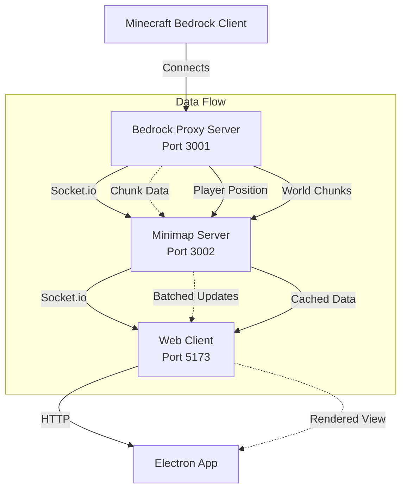

# Minecraft Bedrock Minimap Documentation

Welcome to the comprehensive documentation for the Minecraft Bedrock Minimap system. This project provides a real-time minimap for Minecraft Bedrock Edition with advanced features like ore detection, overlay mode, and performance optimizations.


*Real-time minimap overlay displaying chunks and terrain while playing Minecraft Bedrock Edition*

## 🚀 Quick Start

- [Development Setup](./guides/development-setup.md) - Get started with development
- [Architecture Overview](./architecture/overview.md) - Understand the system design
- [API Reference](./api/socket-events.md) - Socket.io event documentation
- [Gallery](./gallery.md) - Visual showcase of features and UI

## 📁 Documentation Structure

### Architecture

- [System Overview](./architecture/overview.md) - High-level system architecture and design decisions
- [Communication Flow](./architecture/communication-flow.md) - Socket.io event flows and data synchronization
- [Data Models](./architecture/data-models.md) - TypeScript interfaces and type definitions
- [Performance](./architecture/performance.md) - Optimization strategies and benchmarks

### Core Concepts

- [Chunks and Subchunks](./concepts/chunks-and-subchunks.md) - Understanding Minecraft world structure
- [SubChunk Data Parsing](./concepts/subchunk-parsing.md) - How Minecraft packets become minimap data
- [Coordinate Systems](./concepts/coordinate-systems.md) - Block vs chunk coordinate conversion
- [Block Colors](./concepts/block-colors.md) - Color mapping system and customization
- [Rendering Pipeline](./concepts/rendering-pipeline.md) - Canvas rendering and optimization techniques

### Package Documentation

- [bedrock-proxy-server](./packages/bedrock-proxy-server.md) - Minecraft Bedrock protocol proxy
- [minimap-server](./packages/minimap-server.md) - Bridge server for chunk management
- [minimap-web-server](./packages/minimap-web-server.md) - Web client and rendering engine
- [electron-app](./packages/electron-app.md) - Desktop application with overlay mode
- [shared](./packages/shared.md) - Shared types, utilities, and constants

### Development Guides

- [Development Setup](./guides/development-setup.md) - Environment setup and prerequisites
- [Debugging](./guides/debugging.md) - Debugging techniques and tools
- [Testing](./guides/testing.md) - Testing strategies and running tests
- [Deployment](./guides/deployment.md) - Building and deploying the application

### API Reference

- [Socket.io Events](./api/socket-events.md) - Complete event reference with examples

## 🏗️ System Architecture



## 🔧 Key Technologies

### Runtime & Languages
- **Node.js 18+** - JavaScript runtime with native TypeScript support
- **TypeScript 5+** - Type-safe development with strict mode
- **ES Modules** - Modern JavaScript module system

### Communication
- **Socket.io** - Real-time bidirectional communication
- **bedrock-protocol** - Minecraft Bedrock Edition protocol implementation

### Rendering
- **Canvas API** - 2D graphics rendering
- **OffscreenCanvas** - Performance optimization
- **ImageBitmap** - GPU-accelerated rendering

### Framework
- **Electron** - Cross-platform desktop application
- **Vite** - Fast development server and build tool
- **Zod** - Runtime type validation for settings

## 🎯 Key Features

### Core Functionality
- **Real-time Minimap** - Live view of surrounding chunks
- **Player Tracking** - Smooth position updates
- **Multi-dimension Support** - Overworld, Nether, and End
- **Chunk Caching** - Intelligent memory management

### Advanced Features
- **Ore Detection Mode** - Highlight valuable resources
- **Overlay Mode** - Transparent minimap overlay
- **Performance Optimizations** - 60 FPS with hundreds of chunks
- **Dynamic Proxy Settings** - Runtime configuration changes

### Developer Features
- **Monorepo Structure** - Organized package management
- **Hot Module Replacement** - Fast development iteration
- **TypeScript Project References** - Proper type checking
- **Comprehensive Logging** - Debugging and monitoring

## 📊 Performance Metrics

- **Rendering**: 60 FPS with 100+ visible chunks
- **Network**: 80% reduction through intelligent batching
- **Memory**: Efficient caching with configurable limits
- **CPU**: Optimized chunk processing algorithms

## 🚦 Getting Started

1. **Prerequisites**
   ```bash
   # Node.js 18+ and npm required
   node --version  # Should be 22.17.0 or higher
   npm --version   # Should be 8.0.0 or higher
   ```

2. **Installation**
   ```bash
   git clone <repository>
   cd minecraft-bedrock-minimap
   npm install
   ```

3. **Development**
   ```bash
   npm run dev      # Start all services
   npm run dev:all  # Include Electron app
   ```

4. **Configuration**
   - Copy `.env.example` to `.env`
   - Set `MC_SERVER_HOST` and `MC_SERVER_PORT`
   - Configure other options as needed

## 📚 Additional Resources

### PRP Documentation
The project uses the PRP (Product Requirement Prompt) Framework. See the `/PRPs` directory for detailed feature specifications.

### Contributing
See [CONTRIBUTING.md](../CONTRIBUTING.md) for guidelines on contributing to the project.

### License
This project is licensed under the terms specified in [LICENSE](../LICENSE).

---

For questions or issues, please refer to the [troubleshooting guide](./guides/debugging.md) or open an issue on GitHub.