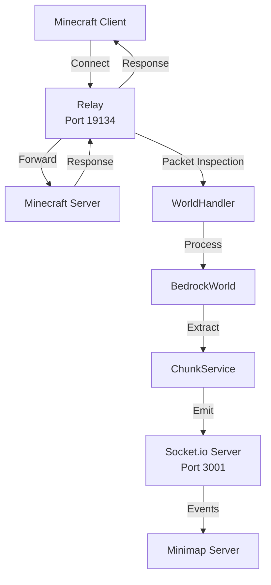

# Bedrock Proxy Server

The bedrock-proxy-server acts as a bridge between Minecraft Bedrock Edition and the minimap system, extracting world data and player information.

## Overview

This package creates a proxy server that intercepts Minecraft Bedrock protocol packets, processes world data, and emits it via Socket.io for consumption by the minimap system.

## Architecture



## Key Components

### Main Server (`src/index.ts`)
The entry point that:
- Initializes Socket.io server on port 3001
- Sets up the relay for packet interception
- Manages client subscriptions
- Handles graceful shutdown

### Relay System
Uses `bedrock-protocol` library to create a transparent proxy:

```javascript
const relay = new Relay({
  version: "1.21.93",
  host: "0.0.0.0",
  port: 19134,
  destination: {
    host: process.env.MC_SERVER_HOST,
    port: parseInt(process.env.MC_SERVER_PORT)
  }
});
```

### WorldHandler
Processes Minecraft protocol packets:
- `level_chunk`: Full chunk data
- `subchunk`: Subchunk updates
- `update_block`: Individual block changes
- `move_player`: Player position updates

### BedrockWorld
In-memory world storage:
- Manages loaded chunks
- Handles block updates
- Supports chunk serialization
- Maintains world state

### ChunkService
Processes chunk requests:
- Converts prismarine chunks to JSON
- Extracts surface blocks
- Prepares data for transmission

## Configuration

### Environment Variables

| Variable | Default | Description |
|----------|---------|-------------|
| PORT | 3001 | Socket.io server port |
| CORS_ORIGINS | http://localhost:3002 | Allowed CORS origins |
| MC_VERSION | 1.21.93 | Minecraft version |
| MC_SERVER_HOST | - | Target Minecraft server |
| MC_SERVER_PORT | 19132 | Minecraft server port |
| RELAY_ENABLED | true | Enable relay mode |
| RELAY_HOST | 0.0.0.0 | Relay listen address |
| RELAY_PORT | 19134 | Relay listen port |
| ENABLE_CHUNK_CACHING | true | Enable chunk cache |
| ENABLE_DEBUG_LOGGING | false | Debug output |

### Connection Setup

1. **Minecraft Client Configuration**:
   - Server Address: Your computer's IP
   - Port: 19134 (relay port)

2. **Proxy Target Configuration**:
   - Set `MC_SERVER_HOST` to actual server
   - Set `MC_SERVER_PORT` if non-standard

## Socket.io Events

### Emitted Events

#### `connection-status`
Initial connection information.
```typescript
{
  connected: boolean;
  playerId?: string;
  timestamp: number;
}
```

#### `player-position`
Player location and rotation updates.
```typescript
{
  x: number;  // Block X
  y: number;  // Block Y
  z: number;  // Block Z
  yaw: number;   // Horizontal rotation
  pitch: number; // Vertical rotation
}
```

#### `chunk-data`
Chunk information for the minimap.
```typescript
{
  type: "chunk";
  x: number;       // Chunk X
  z: number;       // Chunk Z
  dimension: number;
  timestamp: number;
  chunks: Array<{
    position: { x, y, z };
    chunk: ChunkData; // Serialized chunk
  }>;
}
```

### Received Events

#### `subscribe`
Client subscribes to player updates.
```typescript
payload: string // Player ID
```

#### `unsubscribe`
Client unsubscribes from updates.
```typescript
payload: string // Player ID
```

## Features

### Packet Simulation Mode
For development without a Minecraft server:

```javascript
// Enable simulation mode
RELAY_ENABLED=false
SIMULATION_FILE=./recorded-packets.json

// The server will replay recorded packets
```

### Packet Recording
Record packet streams for later playback:

```javascript
ENABLE_PACKET_DUMPS=true
DUMP_PATH=./packet-dumps/

// Packets are saved with timestamps
```

### Chunk Caching
Efficient chunk storage using blob store:
- Reduces memory usage
- Persistent across restarts
- Automatic cleanup of old chunks

## Development

### Running the Server

```bash
# Development mode
npm run dev:proxy

# Production mode
npm run build
npm run start:proxy

# With debug logging
ENABLE_DEBUG_LOGGING=true npm run dev:proxy
```

### Testing

```bash
# Unit tests
npm test packages/bedrock-proxy-server

# With packet simulation
npm run test:simulation
```

## Troubleshooting

### Connection Issues

**Problem**: Can't connect to Minecraft server
- Check firewall allows port 19134
- Verify `MC_SERVER_HOST` is correct
- Ensure server allows LAN connections
- Try direct IP instead of hostname

**Problem**: No chunks appearing
- Enable debug logging
- Check relay is properly connected
- Verify chunk caching is working
- Look for WorldHandler errors

### Performance Issues

**Problem**: High memory usage
- Reduce chunk cache size
- Enable blob store caching
- Limit loaded chunks
- Monitor with memory profiler

**Problem**: Lag or delays
- Check network latency
- Reduce Socket.io event frequency
- Enable batching
- Profile packet processing

### Development Tips

1. **Use Packet Dumps**:
   - Record real gameplay
   - Replay for consistent testing
   - No Minecraft server needed

2. **Monitor Blob Store**:
   ```bash
   ls -la .blob-store/
   # Check cache effectiveness
   ```

3. **Debug Packet Flow**:
   ```javascript
   // Add to WorldHandler
   console.log('Packet:', packet.name, packet.params);
   ```

4. **Test Different Versions**:
   - Update `MC_VERSION` for compatibility
   - Test with various Bedrock versions

## Integration

### Connecting Minimap Server

The minimap server connects as a Socket.io client:

```javascript
const socket = io('http://localhost:3001', {
  reconnection: true,
  reconnectionAttempts: Infinity
});

socket.on('connect', () => {
  socket.emit('subscribe', playerId);
});

socket.on('chunk-data', (data) => {
  // Process chunks
});
```

### Data Flow

1. Minecraft client connects to relay
2. Relay forwards packets bidirectionally
3. WorldHandler intercepts relevant packets
4. Chunks stored in BedrockWorld
5. ChunkService processes requests
6. Data emitted via Socket.io
7. Minimap server receives and caches

## Advanced Configuration

### Custom Relay Options

```javascript
// Modify relay behavior
relay.on('join', (client) => {
  console.log('Player joined:', client.username);
});

relay.on('packet', (packet, client) => {
  // Custom packet processing
});
```

### Performance Tuning

```javascript
// Adjust chunk processing
MAX_LOADED_CHUNKS = 10000;
CHUNK_PROCESS_BATCH = 10;
CACHE_CLEANUP_INTERVAL = 300000; // 5 minutes
```

The bedrock-proxy-server provides a robust foundation for extracting world data from Minecraft Bedrock Edition, with extensive configuration options and debugging capabilities.