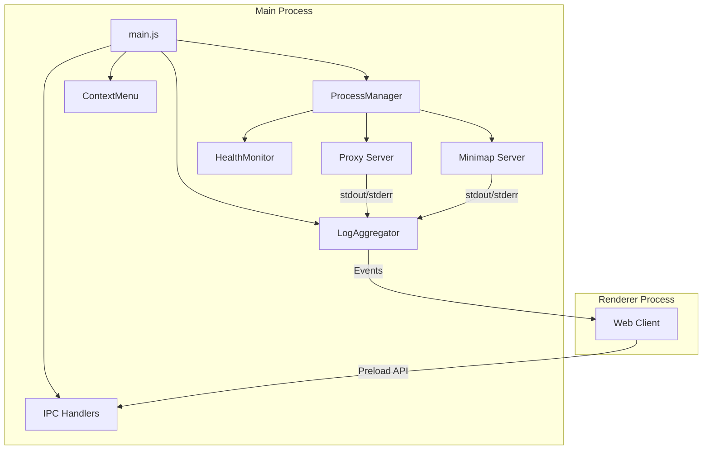
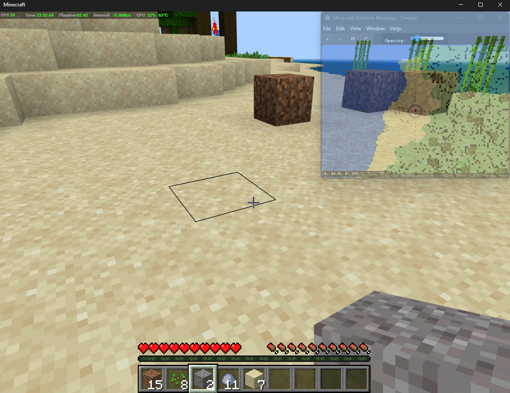

# Electron App

The electron-app provides a desktop wrapper for the minimap with advanced features like overlay mode, process management, and native integrations.

## Overview

This package delivers:
- Desktop application with overlay capabilities
- Automatic process management for all services
- Native window controls and context menus
- Log aggregation and monitoring
- Persistent settings and configuration

## Architecture



## Key Components

### Main Process (`src/main.js`)

Application entry point:
- Creates and manages BrowserWindow
- Initializes all services
- Handles IPC communication
- Manages application lifecycle

```javascript
// Window configuration
const mainWindow = new BrowserWindow({
  width: 512,
  height: 512,
  frame: !store.get('settings.framelessMode', false),
  transparent: isOverlay,
  alwaysOnTop: isOverlay,
  webPreferences: {
    preload: path.join(__dirname, 'preload.js'),
    contextIsolation: true,
    nodeIntegration: false
  }
});
```

### Process Manager (`src/services/process-manager.js`)

Comprehensive child process management:

```javascript
class ProcessManager extends EventEmitter {
  // Service definitions
  services = {
    proxy: {
      name: 'Bedrock Proxy Server',
      command: 'npm',
      args: ['run', 'dev:proxy'],
      healthCheck: 'http://localhost:3001/health'
    },
    minimap: {
      name: 'Minimap Server',
      command: 'npm',
      args: ['run', 'dev:minimap'],
      healthCheck: 'http://localhost:3002/health'
    }
  };
  
  // Features:
  // - Automatic restart with backoff
  // - Health monitoring
  // - Graceful shutdown
  // - Orphan process cleanup
}
```

### Log Aggregator (`src/services/log-aggregator.js`)

Centralized logging system:

```javascript
class LogAggregator extends EventEmitter {
  // Circular buffer for memory efficiency
  private buffers = {
    global: new CircularBuffer(10000),
    proxy: new CircularBuffer(5000),
    minimap: new CircularBuffer(5000)
  };
  
  // Features:
  // - Real-time log streaming
  // - Search and filtering
  // - Log level filtering
  // - Export capabilities
}
```

### Health Monitor (`src/services/health-monitor.js`)

Service health tracking:

```javascript
class HealthMonitor extends EventEmitter {
  // HTTP-based health checks
  async checkHealth(url) {
    try {
      const response = await fetch(url);
      return response.ok;
    } catch {
      return false;
    }
  }
  
  // Configurable intervals
  // Automatic restart triggers
  // Health history tracking
}
```

### Context Menu (`src/context-menu.js`)

Right-click menu system:

```javascript
const contextMenuTemplate = [
  {
    label: 'Opacity',
    submenu: [
      { label: '30%', click: () => setOpacity(0.3) },
      { label: '50%', click: () => setOpacity(0.5) },
      { label: '70%', click: () => setOpacity(0.7) },
      { label: '100%', click: () => setOpacity(1.0) }
    ]
  },
  {
    label: 'Window Frame',
    type: 'checkbox',
    checked: hasFrame,
    click: toggleFrame
  },
  {
    label: 'Always on Top',
    type: 'checkbox',
    checked: isAlwaysOnTop,
    click: toggleAlwaysOnTop
  }
];
```

## IPC Communication

### Preload Script (`src/preload.js`)

Secure API exposure:

```javascript
contextBridge.exposeInMainWorld('electronAPI', {
  // Window controls
  window: {
    minimize: () => ipcRenderer.invoke('window:minimize'),
    maximize: () => ipcRenderer.invoke('window:maximize'),
    close: () => ipcRenderer.invoke('window:close')
  },
  
  // Overlay features
  overlay: {
    setOpacity: (value) => ipcRenderer.invoke('overlay:set-opacity', value),
    getOpacity: () => ipcRenderer.invoke('overlay:get-opacity'),
    setAlwaysOnTop: (value) => ipcRenderer.invoke('overlay:set-always-on-top', value),
    isOverlay: () => ipcRenderer.invoke('overlay:is-overlay')
  },
  
  // Process management
  process: {
    getStatus: () => ipcRenderer.invoke('process:get-status'),
    restart: (service) => ipcRenderer.invoke('process:restart', service),
    getLogs: (service, options) => ipcRenderer.invoke('process:get-logs', service, options)
  },
  
  // Settings
  settings: {
    get: (key) => ipcRenderer.invoke('settings:get', key),
    set: (key, value) => ipcRenderer.invoke('settings:set', key, value)
  }
});
```

### Event System

Real-time updates via events:

```javascript
// Main process
win.webContents.send('process:status-update', {
  service: 'proxy',
  status: 'running',
  pid: 12345
});

// Renderer process
window.electronAPI.on('process:status-update', (data) => {
  updateServiceStatus(data);
});
```

## Configuration

### Persistent Settings

Using `electron-store`:

```javascript
const schema = {
  settings: {
    type: 'object',
    properties: {
      overlayMode: { type: 'boolean', default: false },
      framelessMode: { type: 'boolean', default: false },
      opacity: { type: 'number', minimum: 0.3, maximum: 1, default: 0.7 },
      alwaysOnTop: { type: 'boolean', default: false },
      windowBounds: {
        type: 'object',
        properties: {
          width: { type: 'number', default: 512 },
          height: { type: 'number', default: 512 }
        }
      }
    }
  },
  proxy: {
    type: 'object',
    // Proxy configuration schema
  }
};
```

### Environment Variables

```bash
# Development
NODE_ENV=development

# Skip service auto-start
SKIP_SERVICE_START=true

# Custom config path
ELECTRON_STORE_PATH=/custom/path
```

## Features

### Overlay Mode

Transparent minimap overlay for seamless gaming experience:


*Electron overlay mode showing real-time minimap while playing Minecraft Bedrock Edition*

```javascript
// Enable overlay mode
mainWindow.setAlwaysOnTop(true);
mainWindow.setIgnoreMouseEvents(false);
mainWindow.setOpacity(0.7);

// Platform-specific handling
if (process.platform === 'linux') {
  // X11/Wayland transparency
  mainWindow.setBackgroundColor('#00000000');
}
```

### Process Management

Automatic service lifecycle:

```javascript
// Start all services
await processManager.startAll();

// Monitor health
healthMonitor.on('unhealthy', (service) => {
  console.log(`Service ${service} is unhealthy, restarting...`);
  processManager.restart(service);
});

// Graceful shutdown
app.on('before-quit', async () => {
  await processManager.stopAll();
});
```

### Restart Strategies

Configurable restart behavior:

```javascript
const strategies = {
  default: {
    maxRetries: 5,
    baseDelay: 1000,
    maxDelay: 30000,
    multiplier: 2
  },
  aggressive: {
    maxRetries: 10,
    baseDelay: 500,
    maxDelay: 10000,
    multiplier: 1.5
  },
  conservative: {
    maxRetries: 3,
    baseDelay: 5000,
    maxDelay: 60000,
    multiplier: 3
  }
};
```

### Log Management

Comprehensive logging:

```javascript
// Search logs
const results = logAggregator.search({
  service: 'proxy',
  level: 'error',
  pattern: /connection failed/i,
  timeRange: { start: Date.now() - 3600000 } // Last hour
});

// Export logs
const logs = logAggregator.export({
  format: 'json',
  service: 'all',
  limit: 10000
});
```

## Development

### Running the App

```bash
# Development mode
npm run dev:electron

# Build for production
npm run build:electron

# Package for distribution
npm run dist
```

### Debugging

```bash
# Enable DevTools
npm run dev:electron -- --devtools

# Debug main process
npm run debug:main

# Verbose logging
DEBUG=electron:* npm run dev:electron
```

### Testing

```bash
# Unit tests
npm test packages/electron-app

# E2E tests
npm run test:e2e
```

## Platform-Specific Features

### Windows

- Native frame with custom controls
- Transparency support
- System tray integration (planned)

### macOS

- Native traffic light buttons
- Transparency and vibrancy
- Touch Bar support (planned)

### Linux

- X11/Wayland compatibility
- Desktop integration
- AppImage distribution

## Troubleshooting

### Service Issues

**Services not starting**:
```javascript
// Check process status
const status = await processManager.getStatus();
console.log(status);

// View logs
const logs = await logAggregator.getLogs('proxy', { limit: 100 });

// Manual restart
await processManager.restart('proxy');
```

**Port conflicts**:
```bash
# Check ports
lsof -i :3001
lsof -i :3002

# Kill conflicting processes
kill -9 <PID>
```

### Window Issues

**Transparency not working**:
- Check GPU acceleration
- Verify compositor running (Linux)
- Try different transparency method

**Overlay click-through**:
```javascript
// Toggle click-through
mainWindow.setIgnoreMouseEvents(true, { forward: true });
```

### Performance

**High CPU usage**:
- Check service health
- Monitor log volume
- Reduce health check frequency
- Profile renderer process

**Memory leaks**:
- Clear log buffers periodically
- Monitor service memory
- Check for orphan processes

## Building and Distribution

### Build Configuration

```javascript
// electron-builder.yml
appId: com.minecraft.bedrock.minimap
productName: Minecraft Bedrock Minimap
directories:
  output: dist
files:
  - "!src/**/*.ts"
  - "!**/*.map"
mac:
  category: public.app-category.games
win:
  target: nsis
linux:
  target: AppImage
```

### Code Signing

```bash
# macOS
export APPLE_ID="your-apple-id"
export APPLE_ID_PASSWORD="your-app-specific-password"

# Windows
export CSC_LINK="path/to/certificate.pfx"
export CSC_KEY_PASSWORD="certificate-password"
```

## Security

### Context Isolation

All Node.js APIs isolated from renderer:
- No direct file system access
- Controlled IPC communication
- Validated input/output

### Content Security Policy

```html
<meta http-equiv="Content-Security-Policy" 
      content="default-src 'self'; 
               script-src 'self' 'unsafe-inline'; 
               style-src 'self' 'unsafe-inline';
               connect-src ws://localhost:* http://localhost:*">
```

## Future Enhancements

### Planned Features

- Auto-updater integration
- System tray support
- Global hotkeys
- Multi-window support
- Plugin system
- Cloud sync

### Architecture Improvements

- Service worker for offline mode
- WebRTC for P2P features
- Native modules for performance
- Background service mode

The Electron app provides a robust desktop experience with advanced process management, making the minimap accessible and reliable for everyday use.