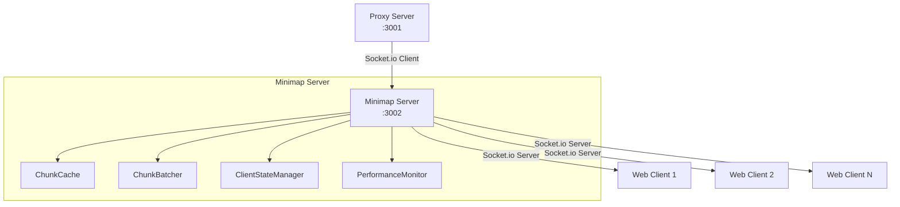
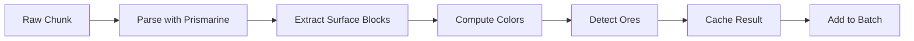

# Minimap Server

The minimap-server acts as an intelligent bridge between the bedrock-proxy-server and web clients, implementing caching, batching, and state management for optimal performance.

## Overview

This package serves as a central hub that:
- Connects to the proxy server as a Socket.io client
- Provides a Socket.io server for web clients
- Manages chunk caching and processing
- Implements intelligent batching to reduce network traffic
- Tracks per-client state for efficient updates

## Architecture



## Key Components

### Main Server (`src/index.ts`)
Orchestrates all components:
- Dual Socket.io connections (client to proxy, server to web)
- Manages service lifecycle
- Handles graceful shutdown
- Monitors connection health

### ChunkCacheService (`src/services/chunk-cache.service.ts`)
LRU cache implementation:
```typescript
class ChunkCacheService {
  private cache: LRUCache<string, ProcessedChunk>;
  private cacheSize = 100000; // Configurable via CHUNK_CACHE_SIZE
  
  // Features:
  // - Automatic eviction when full
  // - Access pattern tracking
  // - Stale chunk invalidation
  // - Cache statistics
}
```

### ChunkUpdateBatcher (`src/services/chunk-update-batcher.ts`)
Intelligent batching system:
```typescript
class ChunkUpdateBatcher {
  private batchSize = 50; // Configurable via CHUNK_BATCH_SIZE
  
  // Deduplicates updates for same chunk
  // Maintains insertion order (FIFO)
  // Groups updates for network efficiency
}
```

### ClientStateManager (`src/services/client-state-manager.ts`)
Per-client tracking:
```typescript
interface ClientState {
  sentChunks: Map<string, number>; // chunk key → timestamp
  pendingUpdates: Set<string>;
  connectionTime: number;
  stats: ClientStatistics;
}
```

### PerformanceMonitor (`src/services/performance-monitor.ts`)
Comprehensive metrics:
- Network reduction percentage
- Cache hit rates
- Memory usage tracking
- Client statistics
- Batch processing metrics

## Configuration

### Environment Variables

| Variable | Default | Description |
|----------|---------|-------------|
| PORT | 3002 | Server port |
| PROXY_URL | http://localhost:3001 | Proxy server URL |
| CORS_ORIGINS | * | Allowed origins |
| CHUNK_CACHE_SIZE | 100000 | Max cached chunks |
| CHUNK_BATCH_SIZE | 50 | Chunks per batch |
| RECONNECTION | true | Auto-reconnect to proxy |
| RECONNECTION_DELAY | 1000 | Reconnect delay (ms) |
| LOG_LEVEL | info | Logging level |
| NODE_ENV | development | Environment mode |

## Socket.io Events

### From Proxy Server (Incoming)

#### `player-position`
```typescript
interface PlayerPosition {
  x: number;
  y: number;
  z: number;
  yaw?: number;
  pitch?: number;
}
```

#### `chunk-data`
```typescript
interface ChunkDataResponse {
  type: "chunk";
  x: number;
  z: number;
  dimension: number;
  chunks: Array<{
    position: { x, y, z };
    chunk: any; // Serialized chunk data
  }>;
}
```

#### `connection-status`
```typescript
interface ConnectionStatus {
  connected: boolean;
  playerId?: string;
  timestamp: number;
}
```

#### `world-reset`
Signals to clear all caches and reset state.

### To Web Clients (Outgoing)

#### `batch-update`
```typescript
interface BatchUpdate {
  chunks: ProcessedChunk[];
  playerPosition?: PlayerPosition;
  timestamp: number;
  batchId: string;
}
```

#### `player-move`
```typescript
interface PlayerMove {
  x: number;
  z: number;
  dimension: number;
}
```

#### `connection-status`
Forwarded from proxy server.

### From Web Clients (Incoming)

#### `request-initial-chunks`
Request cached chunks on connection.

#### `minimap-click`
Handle minimap click events (future: teleportation).

## Performance Features

### Intelligent Batching
Reduces network traffic by ~80%:

```typescript
// Before: 50 individual events
socket.emit('chunk-data', chunk1);
socket.emit('chunk-data', chunk2);
// ... 48 more

// After: 1 batched event
socket.emit('batch-update', {
  chunks: [chunk1, chunk2, ...],
  batchId: 'batch-123'
});
```

### Per-Client State Tracking
Prevents redundant updates:

```typescript
// Only send chunks client doesn't have
if (!clientState.hasSentChunk(chunkKey)) {
  pendingUpdates.add(chunkKey);
}
```

### Chunk Processing Pipeline



### Memory Management
- LRU eviction when cache full
- Old client state cleanup (5 min)
- Configurable cache limits
- Memory usage monitoring

## Development

### Running the Server

```bash
# Development mode
npm run dev:minimap

# Production mode
npm run build
npm run start:minimap

# With debug logging
LOG_LEVEL=debug npm run dev:minimap
```

### Testing

```bash
# Unit tests
npm test packages/minimap-server

# Integration tests
npm run test:integration
```

### Monitoring

Access performance metrics:

```typescript
// In development, metrics logged every 30s
// Example output:
Performance Metrics: {
  networkReduction: 82.5%,
  cacheHitRate: 95.2%,
  avgBatchSize: 47.3,
  activeClients: 3,
  cachedChunks: 45231
}
```

## Troubleshooting

### Connection Issues

**Cannot connect to proxy**:
```bash
# Check proxy is running
curl http://localhost:3001/socket.io/

# Verify PROXY_URL
echo $PROXY_URL

# Test with direct connection
PROXY_URL=http://127.0.0.1:3001 npm run dev:minimap
```

**Web clients not receiving updates**:
- Check CORS settings
- Verify client subscriptions
- Monitor batch processing
- Check client state manager

### Performance Issues

**High memory usage**:
```bash
# Reduce cache size
CHUNK_CACHE_SIZE=50000 npm run dev:minimap

# Monitor cache statistics
# Look for low hit rates indicating thrashing
```

**Slow chunk processing**:
- Check ore detection overhead
- Monitor batch sizes
- Profile chunk processing time
- Consider disabling features

### Debugging

Enable detailed logging:

```javascript
// Add to environment
LOG_LEVEL=debug
NODE_ENV=development

// Enables:
// - Detailed chunk processing logs
// - Client state changes
// - Batch composition details
// - Cache operations
```

## Integration

### Connecting from Web Client

```javascript
import { io } from 'socket.io-client';

const socket = io('http://localhost:3002', {
  transports: ['websocket'],
  reconnection: true
});

socket.on('connect', () => {
  console.log('Connected to minimap server');
  socket.emit('request-initial-chunks');
});

socket.on('batch-update', (batch) => {
  processBatchUpdate(batch);
});
```

### Data Flow Example

1. **Chunk arrives from proxy**:
   ```
   proxy → chunk-data → minimap server
   ```

2. **Processing**:
   ```
   parse → colors → cache → batch
   ```

3. **Client notification**:
   ```
   batch ready → send to clients → update state
   ```

## Advanced Features

### Custom Processing

Add custom chunk processors:

```typescript
// In chunk processing pipeline
chunkProcessor.addProcessor({
  name: 'custom-biome-colors',
  process: (chunk) => {
    // Modify chunk colors based on biome
    return modifiedChunk;
  }
});
```

### Performance Tuning

```typescript
// Aggressive batching for slow networks
CHUNK_BATCH_SIZE=100

// Larger cache for dense worlds
CHUNK_CACHE_SIZE=200000

// Faster cleanup for low memory
CLIENT_STATE_CLEANUP_INTERVAL=60000 // 1 minute
```

### Scaling Considerations

For multiple servers:
- Add Redis for shared cache
- Implement sticky sessions
- Use message queue for updates
- Consider horizontal scaling

## Metrics and Monitoring

### Available Metrics

```typescript
interface PerformanceMetrics {
  // Network
  networkReduction: number;     // Percentage saved
  totalBytesSaved: number;      // Cumulative savings
  
  // Cache
  cacheHitRate: number;         // Hit percentage
  cacheSize: number;            // Current entries
  cacheMemoryMB: number;        // Memory usage
  
  // Clients
  activeClients: number;        // Connected count
  totalChunksSent: number;      // Cumulative sent
  avgChunksPerClient: number;   // Average per client
  
  // Processing
  avgBatchSize: number;         // Chunks per batch
  batchesPerMinute: number;     // Send rate
  processingTimeMs: number;     // Avg process time
}
```

The minimap-server efficiently bridges the gap between raw Minecraft data and web visualization, implementing sophisticated optimizations to ensure smooth real-time updates even with multiple connected clients.