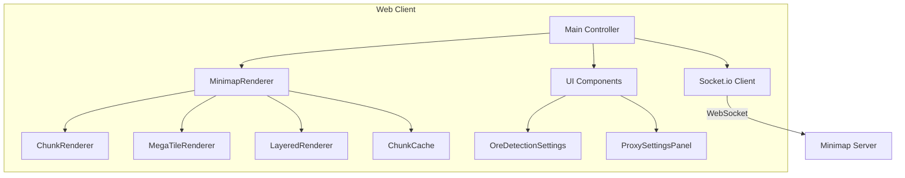

# Minimap Web Server

The minimap-web-server provides the web-based visualization client with advanced rendering capabilities, ore detection, and real-time updates.

## Overview

This package delivers:
- High-performance canvas-based minimap rendering
- Real-time chunk updates via Socket.io
- Advanced features like ore detection and viewport management
- Configurable UI with proxy settings
- Support for both web and Electron environments

## Architecture



## Key Components

### Main Entry (`src/main.ts`)
Application orchestrator:
- Initializes all components
- Manages application state
- Handles Socket.io events
- Coordinates rendering and UI
- Manages Electron integration

### Rendering System

#### MinimapRenderer (`src/rendering/MinimapRenderer.ts`)
Core rendering engine with two modes:

```typescript
class MinimapRenderer {
  // Legacy mode: Simple per-chunk rendering
  private renderLegacy(): void
  
  // Optimized mode: Advanced techniques
  private renderOptimized(): void {
    // Viewport culling
    // MegaTile grouping
    // Dirty region tracking
    // Layer composition
  }
}
```

#### ChunkRenderer (`src/rendering/ChunkRenderer.ts`)
Individual chunk rendering:
- Color batching for performance
- ImageBitmap support for GPU acceleration
- Multi-resolution rendering
- Ore highlight overlays

#### MegaTileRenderer (`src/rendering/MegaTileRenderer.ts`)
Groups chunks for efficiency:
```typescript
// Groups 3x3 or 5x5 chunks
// Reduces draw calls by 89-96%
// Async ImageBitmap creation
// Intelligent cache invalidation
```

#### LayeredRenderer (`src/rendering/LayeredRenderer.ts`)
Three-layer system:
1. **Base Layer**: Static terrain
2. **Updates Layer**: Recent changes
3. **Overlay Layer**: UI elements, player marker

### UI Components

#### OreDetectionSettings (`src/ui/ore-detection-settings.ts`)
Comprehensive ore configuration:


*Ore type selection showing individual toggles and Y-level ranges for each ore type*


*Advanced settings including highlight style, background dimming, and Y-level scan range controls*

Features:
- Individual ore type toggles
- Y-level range settings
- Highlight style selection
- Background dimming control
- Preset configurations

#### ProxySettingsPanel (`src/ui/ProxySettingsPanel.ts`)
Multi-tab configuration interface:
- **General**: Server connection settings
- **Connection**: Network parameters
- **Performance**: View distance, socket settings
- **Advanced**: Debug options, packet simulation

### Performance Systems

#### ChunkCache (`src/rendering/ChunkCache.ts`)
Multi-resolution LRU cache:
```typescript
class ChunkCache {
  private resolutions = [64, 128, 256];
  private maxMemoryMB = 100;
  
  // Resolution-aware caching
  // Memory pressure handling
  // Automatic eviction
}
```

#### ChunkViewportManager (`src/rendering/ChunkViewportManager.ts`)
Intelligent viewport tracking:
- Visible chunk calculation
- Predictive loading based on velocity
- Distance-based prioritization
- Efficient bounds checking

## Configuration

### Runtime Settings

```typescript
interface MinimapSettings {
  rendering: {
    blockSize: number;        // 1-512 pixels
    renderDistance: number;   // Chunks
    useMegaTiles: boolean;
    useImageBitmap: boolean;
    showGrid: boolean;
    backgroundColor: string;
  };
  
  oreDetection: {
    enabled: boolean;
    scanYOffset: number;
    highlightStyle: 'bright' | 'glow' | 'outline';
    backgroundDim: number;    // 0-1
    oreTypes: Record<OreType, OreConfig>;
  };
  
  performance: {
    targetFPS: number;
    adaptiveQuality: boolean;
    maxCacheMemoryMB: number;
  };
}
```

### Environment Detection

```typescript
// Automatically detects environment
const isElectron = !!window.electronAPI;
const isOverlayMode = window.electronAPI?.isOverlay?.();
```

## Features

### Ore Detection System

Sophisticated ore visualization:

```typescript
// 11 ore types supported
enum OreType {
  COAL, IRON, COPPER, GOLD, REDSTONE,
  LAPIS, DIAMOND, EMERALD, QUARTZ,
  NETHER_GOLD, ANCIENT_DEBRIS
}

// Three highlight styles
// Y-level filtering
// Priority-based rendering
// Background dimming for contrast
```

### Viewport Management

Dynamic chunk loading:

```typescript
// Velocity-based prediction
const velocity = calculateVelocity(oldPos, newPos, deltaTime);
const predictedPosition = extrapolatePosition(currentPos, velocity);
const chunksToPreload = getChunksAroundPosition(predictedPosition);
```

### Performance Optimizations

#### Rendering Pipeline
1. **Viewport Culling**: Only visible chunks
2. **Cache Check**: Use pre-rendered chunks
3. **Batch Rendering**: Group by color/type
4. **MegaTiles**: Combine adjacent chunks
5. **Dirty Regions**: Update only changes
6. **Layer Composition**: Separate static/dynamic

#### Adaptive Quality
```typescript
if (fps < 30) {
  settings.rendering.blockSize *= 2;
  settings.rendering.renderDistance -= 2;
} else if (fps > 55) {
  settings.rendering.blockSize /= 2;
  settings.rendering.renderDistance += 1;
}
```

## Socket.io Integration

### Event Handling

```typescript
// Connection management
socket.on('connect', () => {
  console.log('Connected to minimap server');
  socket.emit('request-initial-chunks');
});

// Batch updates
socket.on('batch-update', (batch: BatchUpdate) => {
  processChunkBatch(batch.chunks);
  updatePlayerPosition(batch.playerPosition);
});

// Player movement
socket.on('player-move', (position: PlayerPosition) => {
  smoothPlayerMovement(position);
});
```

### Type Safety

Uses shared types for consistency:

```typescript
import type {
  ChunkData,
  PlayerPosition,
  BatchUpdate,
  OreLocation
} from '@minecraft-bedrock-minimap/shared';
```

## Development

### Setup

```bash
# Install dependencies
npm install

# Development server (Vite)
npm run dev:web

# Build for production
npm run build
```

### Project Structure

```
src/
├── main.ts              # Entry point
├── socket.ts            # Socket.io client
├── rendering/           # Rendering components
│   ├── MinimapRenderer.ts
│   ├── ChunkRenderer.ts
│   ├── MegaTileRenderer.ts
│   ├── LayeredRenderer.ts
│   └── ChunkCache.ts
├── ui/                  # UI components
│   ├── ore-detection-settings.ts
│   └── ProxySettingsPanel.ts
├── styles/              # CSS styles
└── utils/               # Utilities
```

## Electron Integration

### Overlay Mode

Special features when running in Electron:

```typescript
// Opacity control
window.electronAPI.overlay.setOpacity(0.7);

// Always on top
window.electronAPI.overlay.setAlwaysOnTop(true);

// Window controls
window.electronAPI.window.minimize();
```

### IPC Communication

```typescript
// Get proxy settings
const settings = await window.electronAPI.proxy.getSettings();

// Update settings
await window.electronAPI.proxy.updateSettings(newSettings);

// Restart proxy
await window.electronAPI.proxy.restart();
```

## Performance Monitoring

### Built-in Metrics

```typescript
class PerformanceMonitor {
  fps: MovingAverage;
  frameTime: MovingAverage;
  cacheHitRate: number;
  visibleChunks: number;
  drawCalls: number;
}
```

### Debug Overlay

Press `F3` to toggle debug info:
- FPS and frame time
- Cache statistics
- Visible/loaded chunks
- Memory usage
- Network latency

## Troubleshooting

### Rendering Issues

**Black/empty minimap**:
- Check Socket.io connection
- Verify chunk data format
- Check browser console for errors
- Ensure cache isn't corrupted

**Poor performance**:
- Reduce render distance
- Lower block size
- Disable ore detection
- Check cache hit rate

**Visual artifacts**:
- Clear cache (`localStorage.clear()`)
- Disable hardware acceleration
- Check for overlapping chunks
- Verify coordinate calculations

### Connection Problems

**Cannot connect to server**:
```javascript
// Check connection
console.log(socket.connected);

// Enable debug mode
localStorage.debug = 'socket.io-client:*';

// Try direct connection
const socket = io('http://localhost:3002', {
  transports: ['websocket']
});
```

### Memory Issues

**High memory usage**:
```javascript
// Reduce cache size
settings.performance.maxCacheMemoryMB = 50;

// Clear old chunks
chunkCache.clearOldChunks(5 * 60 * 1000); // 5 minutes

// Monitor usage
console.log(performance.memory);
```

## Optimization Guide

### For Low-End Devices

```javascript
const lowEndSettings = {
  rendering: {
    blockSize: 2,
    renderDistance: 4,
    useMegaTiles: false,
    useImageBitmap: false
  },
  performance: {
    targetFPS: 30,
    maxCacheMemoryMB: 25
  }
};
```

### For High-End Devices

```javascript
const highEndSettings = {
  rendering: {
    blockSize: 8,
    renderDistance: 16,
    useMegaTiles: true,
    useImageBitmap: true
  },
  performance: {
    targetFPS: 60,
    maxCacheMemoryMB: 200
  }
};
```

## Future Enhancements

### Planned Features
- WebGL renderer for massive performance
- Touch/mobile support
- Custom color schemes
- Waypoint system
- Structure detection

### WebGL Migration Path

```typescript
// Future WebGL renderer
class WebGLMinimapRenderer {
  // Texture atlas for chunks
  // Instanced rendering
  // GPU-based calculations
  // 10x performance improvement
}
```

The minimap-web-server provides a feature-rich, performant visualization system that scales from low-end devices to high-performance desktops while maintaining a smooth 60 FPS experience.